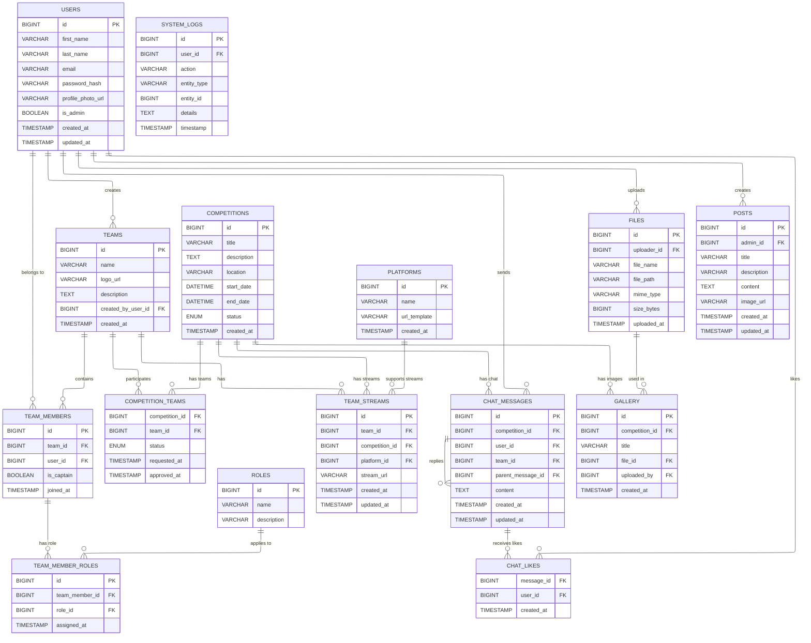

# RobEurope
Redesign of robeurope.com by Samuel Ponce Luna, Ángel Lallave Herrera, and Néstor García Santos from IES El Rincón.

# Stack
- Frontend: React  
- Backend: Node.js + Sequelize  
- Database: MySQL  

---

## 📘 Diagrama Entidad-Relación (ERD)

## Use case diagram

