# RobEurope
Redesign of robeurope.com by Samuel Ponce Luna, Ángel Lallave Herrera, and Néstor García Santos from IES El Rincón.

# Stack
- Frontend: React  
- Backend: Node.js + Sequelize  
- Database: MySQL  

---

## 📘 Diagrama Entidad-Relación (ERD)

```mermaid
erDiagram
    USERS {
        BIGINT id PK
        VARCHAR first_name
        VARCHAR last_name
        VARCHAR email
        VARCHAR password_hash
        VARCHAR phone
        VARCHAR profile_photo_url
        BIGINT country_id FK
        ENUM role "super_admin, user"
        BOOLEAN is_active
        TIMESTAMP created_at
        TIMESTAMP updated_at
    }

    COUNTRIES {
        BIGINT id PK
        VARCHAR code "ISO alpha-2"
        VARCHAR name
        VARCHAR flag_emoji
    }

    TEAMS {
        BIGINT id PK
        VARCHAR name
        VARCHAR short_code 
        BIGINT country_id FK
        VARCHAR city
        VARCHAR institution
        VARCHAR logo_url
        TEXT description
        VARCHAR contact_email
        VARCHAR website_url
        BIGINT created_by_user_id FK
        BOOLEAN is_active
        TIMESTAMP created_at
        TIMESTAMP updated_at
    }

    TEAM_MEMBERS {
        BIGINT id PK
        BIGINT team_id FK
        BIGINT user_id FK
        ENUM role "captain, member, mentor"
        BOOLEAN is_active
        TIMESTAMP joined_at
        TIMESTAMP left_at
    }

    COMPETITIONS {
        BIGINT id PK
        VARCHAR title
        VARCHAR slug
        TEXT description
        VARCHAR location
        BIGINT country_id FK
        DATETIME registration_start
        DATETIME registration_end
        DATETIME start_date
        DATETIME end_date
        ENUM status "draft, open, closed, in_progress, completed, cancelled"
        VARCHAR banner_url
        TEXT rules_url
        INTEGER max_teams
        TIMESTAMP created_at
        TIMESTAMP updated_at
    }

    REGISTRATIONS {
        BIGINT id PK
        BIGINT competition_id FK
        BIGINT team_id FK
        ENUM status "pending, approved, rejected, disqualified"
        TIMESTAMP requested_at
        TIMESTAMP reviewed_at
        BIGINT reviewed_by_user_id FK
    }

    STREAMS {
        BIGINT id PK
        VARCHAR title
        TEXT description
        VARCHAR platform "twitch, youtube, kick"
        VARCHAR stream_url
        BOOLEAN is_live
        BIGINT host_team_id FK  "opcional"
        BIGINT competition_id FK "opcional"
        TIMESTAMP created_at
    }

    TEAM_SOCIALS {
        BIGINT id PK
        BIGINT team_id FK
        VARCHAR platform "twitter, instagram, discord, github"
        VARCHAR url
        TIMESTAMP created_at
    }

    GLOBAL_POSTS {
        BIGINT id PK
        BIGINT author_user_id FK
        VARCHAR title
        VARCHAR slug
        TEXT content
        VARCHAR cover_image_url
        ENUM status "draft, published"
        BOOLEAN is_pinned
        INTEGER views_count
        TIMESTAMP published_at
        TIMESTAMP created_at
        TIMESTAMP updated_at
    }

    COMPETITION_POSTS {
        BIGINT id PK
        BIGINT competition_id FK
        BIGINT team_id FK "opcional"
        BIGINT author_user_id FK
        VARCHAR title
        TEXT content
        JSON media_urls
        INTEGER likes_count
        BOOLEAN is_featured
        TIMESTAMP created_at
        TIMESTAMP updated_at
    }

    LIKES {
        BIGINT id PK
        BIGINT user_id FK
        ENUM target_type "global_post, competition_post"
        BIGINT target_id
        TIMESTAMP created_at
    }

    CHAT_MESSAGES {
        BIGINT id PK
        BIGINT competition_id FK "opcional"
        BIGINT user_id FK
        BIGINT parent_id FK "opcional"
        TEXT content
        BOOLEAN is_pinned
        BOOLEAN is_deleted
        TIMESTAMP created_at
    }

    CHAT_REACTIONS {
        BIGINT message_id FK
        BIGINT user_id FK
        VARCHAR emoji
        TIMESTAMP created_at
    }

    MEDIA {
        BIGINT id PK
        BIGINT uploaded_by_user_id FK
        ENUM object_type "competition,team,global_post,competition_post,user"
        BIGINT object_id
        ENUM type "photo, video, other"
        VARCHAR title
        VARCHAR file_path
        VARCHAR thumbnail_path
        BOOLEAN is_featured
        TIMESTAMP uploaded_at
    }

    SPONSORS {
        BIGINT id PK
        VARCHAR name
        VARCHAR logo_url
        VARCHAR website_url
        ENUM tier "platinum, gold, silver, bronze"
        INTEGER display_order
        BOOLEAN is_active
        TIMESTAMP created_at
    }

    NOTIFICATIONS {
        BIGINT id PK
        BIGINT user_id FK
        VARCHAR title
        TEXT message
        ENUM type "registration, score, team_invite, mention"
        VARCHAR action_url
        BOOLEAN is_read
        TIMESTAMP created_at
    }

    %% Relaciones (simplificadas)
    USERS }o--|| COUNTRIES : "from"
    USERS ||--o{ TEAM_MEMBERS : "joins"
    USERS ||--o{ TEAMS : "creates"
    USERS ||--o{ GLOBAL_POSTS : "writes"
    USERS ||--o{ COMPETITION_POSTS : "writes"
    USERS ||--o{ CHAT_MESSAGES : "sends"
    USERS ||--o{ NOTIFICATIONS : "receives"
    USERS ||--o{ LIKES : "likes"
    USERS ||--o{ CHAT_REACTIONS : "reacts"
    USERS ||--o{ MEDIA : "uploads"

    COUNTRIES ||--o{ TEAMS : "represents"
    COUNTRIES ||--o{ COMPETITIONS : "hosts"

    TEAMS ||--o{ TEAM_MEMBERS : "has"
    TEAMS ||--o{ REGISTRATIONS : "registers"
    TEAMS ||--o{ TEAM_SOCIALS : "links"
    TEAMS ||--o{ COMPETITION_POSTS : "posts"
    TEAMS ||--o{ MEDIA : "uploads"
    TEAMS ||--o{ STREAMS : "hosts"

    COMPETITIONS ||--o{ REGISTRATIONS : "entries"
    COMPETITIONS ||--o{ COMPETITION_POSTS : "content"
    COMPETITIONS ||--o{ CHAT_MESSAGES : "chat"
    COMPETITIONS ||--o{ MEDIA : "gallery"
    COMPETITIONS ||--o{ STREAMS : "has_stream"

    REGISTRATIONS }o--|| USERS : "reviewed_by"

    CHAT_MESSAGES ||--o{ CHAT_REACTIONS : "reactions"
    CHAT_MESSAGES ||--o{ CHAT_MESSAGES : "replies"


```

## Use case diagram

