# RobEurope
Redesign of robeurope.com by Samuel Ponce Luna, Ángel Lallave Herrera, and Néstor García Santos from IES El Rincón.


([Postman](https://solar-crater-87778.postman.co/workspace/Team-Workspace~863e014b-231f-4611-84da-6746814f344e/collection/15303917-8ce87247-fb50-4d0f-8770-de9131768fd1?action=share&creator=15303917))
([Figma](https://www.figma.com/design/UptdKH6RgmLhRwNIkr5qpU/Sin-t%C3%ADtulo?node-id=0-1&t=WDyHv57bP0Kiux3v-1))
([Swagger Docs](http://46.101.255.106:85/api-docs/))
# Stack
- Frontend: React  
- Backend: Node.js + Sequelize  
- Database: MySQL  


---

## 📘 Diagrama Entidad-Relación (ERD)

```mermaid
erDiagram

  

  USERS {

    BIGINT id PK

    VARCHAR first_name

    VARCHAR last_name

    VARCHAR email

	VARCHAR username

    VARCHAR password_hash

    VARCHAR phone

    VARCHAR profile_photo_url

    BIGINT country_id FK

    ENUM role "super_admin, user"

    BOOLEAN is_active

    TIMESTAMP created_at

    TIMESTAMP updated_at

  }



  COUNTRIES {

    BIGINT id PK

    VARCHAR code "ISO alpha-2"

    VARCHAR name

    VARCHAR flag_emoji

  }



  TEAMS {

    BIGINT id PK

    VARCHAR name

    VARCHAR short_code 

    BIGINT country_id FK

    VARCHAR city

    VARCHAR institution

    VARCHAR logo_url

    TEXT description

    VARCHAR contact_email

    VARCHAR website_url

    JSON social_links "twitter, instagram, discord, github"

    BIGINT created_by_user_id FK

    BOOLEAN is_active

    TIMESTAMP created_at

    TIMESTAMP updated_at

  }



  TEAM_MEMBERS {

    BIGINT id PK

    BIGINT team_id FK

    BIGINT user_id FK

    ENUM role "captain, member"

    BOOLEAN is_active

    TIMESTAMP joined_at

    TIMESTAMP left_at

  }



  COMPETITIONS {

    BIGINT id PK

    VARCHAR title

    VARCHAR slug

    TEXT description

    VARCHAR location

    BIGINT country_id FK

    DATETIME registration_start

    DATETIME registration_end

    DATETIME start_date

    DATETIME end_date

    ENUM status "draft, open, closed, in_progress, completed, cancelled"

    VARCHAR banner_url

    TEXT rules_url

    INTEGER max_teams

    VARCHAR stream_url "twitch, youtube, kick"

    BOOLEAN is_streaming

    TIMESTAMP created_at

    TIMESTAMP updated_at

  }



  REGISTRATIONS {

    BIGINT id PK

    BIGINT competition_id FK

    BIGINT team_id FK

    ENUM status "pending, approved, rejected, disqualified"

    TIMESTAMP requested_at

    TIMESTAMP reviewed_at

    BIGINT reviewed_by_user_id FK

  }



  POSTS {

    BIGINT id PK

    BIGINT competition_id FK "nullable - global if null"

    BIGINT team_id FK "nullable"

    BIGINT author_user_id FK

    VARCHAR title

    VARCHAR slug "nullable - only for global post"

    TEXT content

    VARCHAR cover_image_url

    JSON media_urls

    ENUM status "draft, published"

    BOOLEAN is_pinned

    BOOLEAN is_featured

    INTEGER likes_count

    INTEGER views_count

    TIMESTAMP published_at

    TIMESTAMP created_at

    TIMESTAMP updated_at

  }



  REACTIONS {

    BIGINT id PK

    BIGINT user_id FK

    ENUM target_type "post, chat_message"

    BIGINT target_id

    VARCHAR emoji "❤️ 👍 🔥 😂"

    TIMESTAMP created_at

  }



  NOTIFICATIONS {

    BIGINT id PK

    BIGINT user_id FK

    VARCHAR title

    TEXT message

    ENUM type "registration_status, team_invite, mention"

    VARCHAR action_url

    BOOLEAN is_read

    TIMESTAMP created_at

  }



  SPONSORS {

    BIGINT id PK

    VARCHAR name

    VARCHAR logo_url

    VARCHAR website_url

    ENUM tier "platinum, gold, silver, bronze"

    INTEGER display_order

    BOOLEAN is_active

    TIMESTAMP created_at

  }



  %% Relaciones SQL

  USERS }o--|| COUNTRIES : "from"

  USERS ||--o{ TEAM_MEMBERS : "joins"

  USERS ||--o{ TEAMS : "creates"

  USERS ||--o{ POSTS : "writes"

  USERS ||--o{ NOTIFICATIONS : "receives"

  USERS ||--o{ REACTIONS : "reacts"



  COUNTRIES ||--o{ TEAMS : "represents"

  COUNTRIES ||--o{ COMPETITIONS : "hosts"



  TEAMS ||--o{ TEAM_MEMBERS : "has"

  TEAMS ||--o{ REGISTRATIONS : "registers"

  TEAMS ||--o{ POSTS : "posts"



  COMPETITIONS ||--o{ REGISTRATIONS : "entries"

  COMPETITIONS ||--o{ POSTS : "content"



  REGISTRATIONS }o--|| USERS : "reviewed_by"



```


## Use case diagram
![Use Case Diagram](https://www.plantuml.com/plantuml/png/VLV1ajis3BthApYRWxtJfisbCptq4DT9qypiTZoxsVROWINOHbSY7P9AchJzc7n0JhdrwXyhI0fhIbnrFRCZFJo004W2q7FdmVg-Qwk5UlhqgLeRlQDzRw6cqnUj6bGldQVM167bxaaVmKAdeFR6tleFBIfuZyvqc0bxXsjmgFwg5F_z2FNztffUDslJ6gj-Ev37936sGPlG9zyz2x-8hwmrxyVmFvbvYxK7lMzbWHapnS9FVle-_4QsjF5YfgJptyjdvHBhP-77PeQKlJbzzlsG8K-U_Nf1i6Vh4DB7cJ0kFDmvfgXD2nvsnWv2qntHKqr6enDxBt17cXxolmgfHXVDnxIhNycH1-rnUB-uSprOCke6z-IyXSPSA72y8bgXhE58_lGfxUZRdew9mh07qWFh6hKt3ogt_H6jMZKTwS1DJ-BapsXHrmGJ3rbwfrNfZs9nhy-UgzferPq-ESLhTEICgywo7_xc1OBpoPgu_lNWd_gGN56ERNWwIdgdQrR1H3GcOMP8CfK1UNJZJLljRNzaU-nhoD7fIoExNPsFuWMxtqDB7uUBipdzkssfXelXTFKEQt21XtQyxMchrh-p8E0bEsrNpXkGahgo_lIvPlUSUjMQBRGZyoobA2mLRxr5w7BoW9JK3NXhQjAS4JiodmHyB_Aql4BdvIIlUzGUN94IsJBhKCmb2EsO-3fS2s1lqGMRGhuoUz8PKvOrchaTgGtQ7RN2JczbNByOJpkgeTYLA9WFI_Qd26jj4MJtn5p0UFl6n3jDrg622JV1K_9g2xenkh0iE5kVIyLhlJFiS3lH38HvfMl2RckDozc2pUdSO8DEtPgQv0IAPiBcapcv6ZCdfGYUyMa4cpxUFniwcaTDZL7Bf7GfMXip7xXSYK8fmODQ_BSubulUXGGFvIbqc4c5By_7j-S5XPeVxSWfoyBgQCsMbM-mFi17i5Brnjl4u2JJhxL72tLSOjYV8iSlzJk2s0iS_84AjLeVm8lTy3pT4pQO8W3H4dQGJUWlcBUuHlMgTnuMQdb5z_YGtF0ofj_sMmfrhJxGE-FKyXeRWWT-b4Pe4cZS0N9UvfXK3INMShUbVOpo5vh3x1b_Oq97Q8sJ-vzhhjfs_c3D56dH3QToikgrQT3cHrduB0ZOp4epfJh8a-J_Z_xZxWsoy_Z33k2VyNZdim2CUoWJcP_r_-Mghf45nzGdpUMv_pCvxuSbBlsl5EKzhXHAJoj5qhmAYVIXYK1wJhLuRDPPXk6eWH3xMUshopHi17LfGeBaZKQmh5i8b3S5mQQbNs2vgl8kbr40kMtoFhbD75WvCUQ1ITWSrZ1S9IFIJKfGcaOXagum4N122piRKnZFAdAra0dnKKTPl79zHvrnwcsFOHxj4ltO8pEFqZ5GAstOLupD4cFiLR8yzeCjPaFopAf9ndfvESzHgTKJJEgFeAFQKg31ep5NQeDWawi_WULUowtcinX7_jYve1sc-_YvP6b_yChiqeYkr1MeWtmDB7TjQ4bnfBvacQEzZbDLp3YswSEH1QHtQEaXzmUeqIfl6iEorepOoeKSKr3BsTzKg1iLFAggv_pOT-r_)


---

# 📘 Class Diagram


## Getting Started

### Prerequisites

- Node.js (v16+)
- npm
- MySQL server (local or managed database)

### Installation

1. Clone the repository and install backend dependencies:

```bash
cd backend
npm install
```

2. Configure environment variables by creating a `.env` file in the `backend/` directory:

```env
PORT=3000
DB_HOST=127.0.0.1
DB_PORT=3306
DB_NAME=robeurope
DB_USER=root
DB_PASS=your_password
NODE_ENV=development
JWT_SECRET=your_secret_key_for_jwt
```

3. Seed the database with countries:

```bash
node seeders/run-seed-countries.js
```

4. Start the backend server:

```bash
npm start
```

The server will run at `http://localhost:3000`.

---

## API Endpoints

### Health Check

- **GET** `/api/health` (requires authentication)
  - Returns server status and database connectivity
  - Response: `{ status: "OK", service: "api", db: "up", timestamp: "..." }`

### Authentication

- **POST** `/api/auth/register`
  - Register a new user
  - Body: `{ first_name, last_name, email, password, phone, country_id }`
  - Response: `{ token, user: { id, email, first_name, last_name, role } }`

- **POST** `/api/auth/login`
  - Authenticate and receive JWT token
  - Body: `{ email, password }`
  - Response: `{ token, user: { id, email, first_name, last_name, role } }`

### Countries

- **GET** `/api/countries`
  - List all countries (sorted by name)
  - Response: Array of countries with id, code, name, flag_emoji

- **GET** `/api/countries/:id`
  - Get a specific country by ID
  - Response: Country object

- **POST** `/api/countries` 
  - Create a new country
  - Body: `{ code, name, flag_emoji }`
  - Response: Created country object

- **PUT** `/api/countries/:id`
  - Update a country
  - Body: `{ code?, name?, flag_emoji? }`
  - Response: Updated country object

- **DELETE** `/api/countries/:id`
  - Delete a country
  - Response: `{ message: "Country deleted successfully" }`

### Users

- **GET** `/api/users`
  - List users with optional search
  - Query: `?q=search_term` (searches email, first_name, last_name)
  - Response: Array of users (password_hash excluded)

- **GET** `/api/users/:id`
  - Get a specific user by ID
  - Response: User object

- **GET** `/api/users/me` (requires authentication)
  - Get authenticated user's profile
  - Response: User object (password_hash excluded)

- **PATCH** `/api/users/me` (requires authentication)
  - Update authenticated user's profile
  - Body: `{ first_name?, last_name?, phone?, profile_photo_url?, country_id?, is_active? }`
  - Response: Updated user object

- **DELETE** `/api/users/me` (requires authentication)
  - Delete authenticated user account
  - Response: `{ success: true }`

- **DELETE** `/api/users/:id` (requires authentication)
  - Delete a user by ID
  - Response: `{ success: true }`

### Request/Response Format

- All requests expect `Content-Type: application/json`
- Authentication: Include JWT token in `Authorization: Bearer <token>` header
- Tokens expire after 1 hour

---

## Project Structure

```
backend/
├── controller/        # Business logic (auth, users, countries, database)
├── middleware/        # Authentication, timeout, and custom middleware
├── models/            # Sequelize model definitions
├── routes/api/        # API route definitions
├── seeders/           # Database seed scripts
├── utils/             # Utility functions (logger, token signing)
├── certs/             # SSL certificates for HTTPS
├── public/            # Static files (test UI)
├── config/            # Configuration files
└── index.js           # Application entry point
```

---

## Logging

The backend uses Winston logger with daily file rotation:

- Access logs: `logs/access-YYYY-MM-DD.log`
- Error logs: `logs/error-YYYY-MM-DD.log`
- Exception logs: `logs/exceptions-YYYY-MM-DD.log`

Logs are also output to console in development mode.

---

## SSL/TLS for Production

When `NODE_ENV=production`, the server uses HTTPS with certificates from:

- SSL_KEY_PATH or `backend/certs/key.pem`
- SSL_CERT_PATH or `backend/certs/cert.pem`

---

## Authors

Designed and built by Samuel Ponce Luna, Ángel Lallave Herrera, and Néstor García Santos from IES El Rincón.
