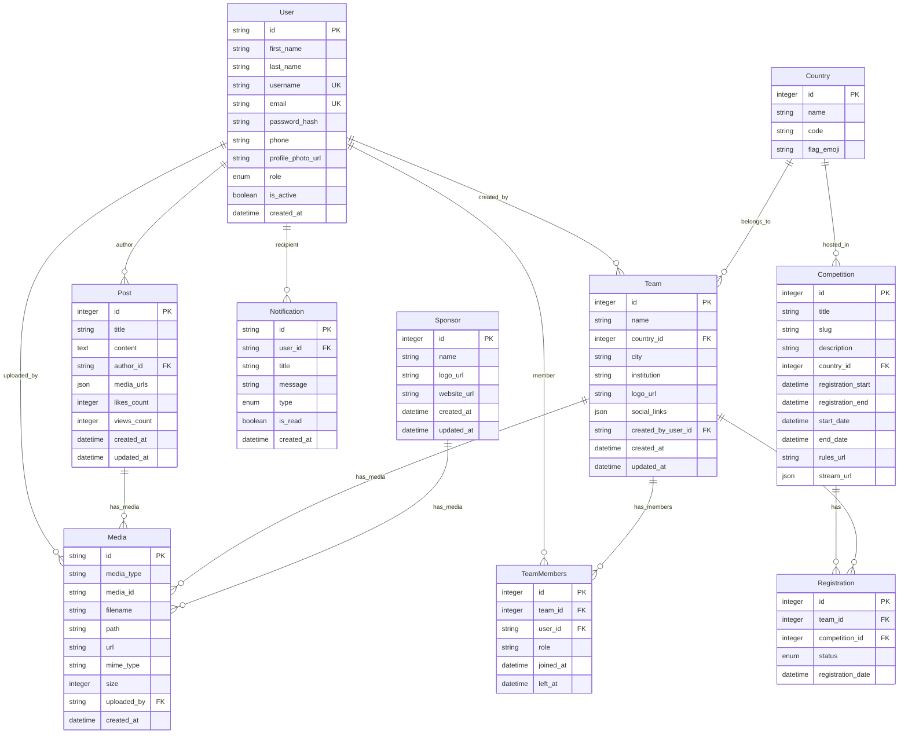
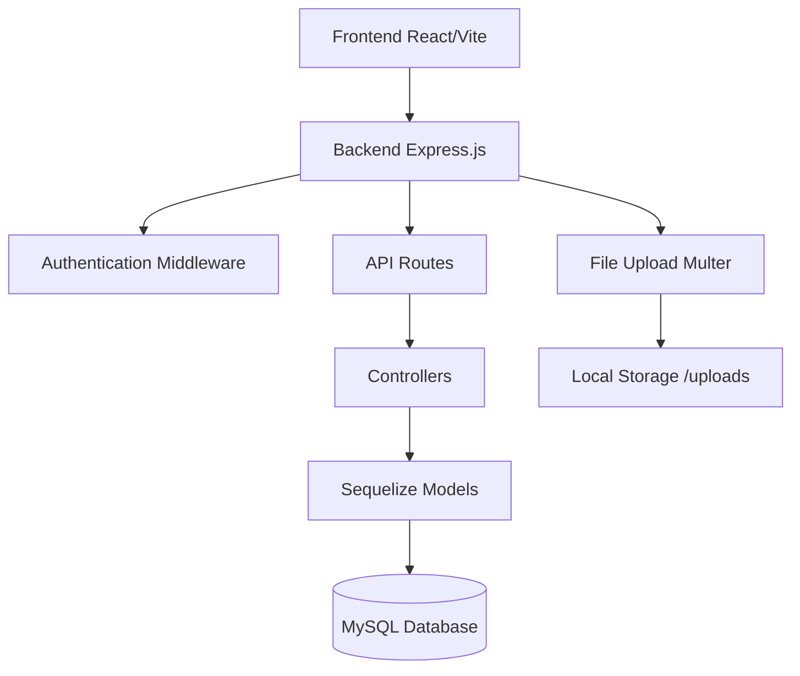
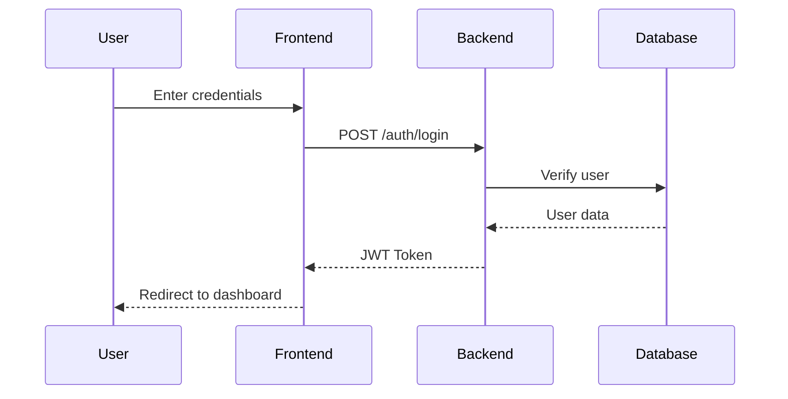
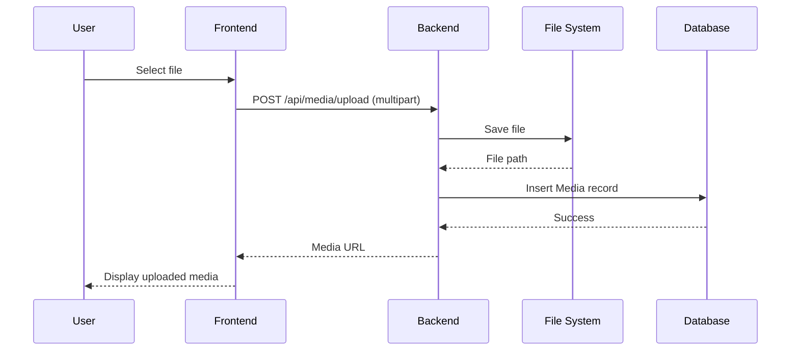

# RobEurope Project Diagrams

This document contains various diagrams for the RobEurope project, including Use Case Diagrams, Entity-Relationship Diagrams (ERD), and other relevant diagrams.

## Use Case Diagram

```mermaid
graph TD
    A[User] --> B[Register]
    A --> C[Login]
    A --> D[View Posts]
    A --> E[Create Post]
    A --> F[Update Own Post]
    A --> G[Delete Own Post]
    A --> H[View Teams]
    A --> I[Create Team]
    A --> J[Update Own Team]
    A --> K[Delete Own Team]
    A --> L[Upload Media]
    A --> M[View Media]
    A --> N[Delete Own Media]

    Admin[Super Admin] --> O[Manage Sponsors]
    Admin --> P[Manage All Users]
    Admin --> Q[Manage All Teams]
    Admin --> R[Manage All Posts]
    Admin --> S[Manage All Media]
```

## Entity-Relationship Diagram (ERD)

## Architecture Diagram

## Sequence Diagram for User Login

## Sequence Diagram for File Upload

