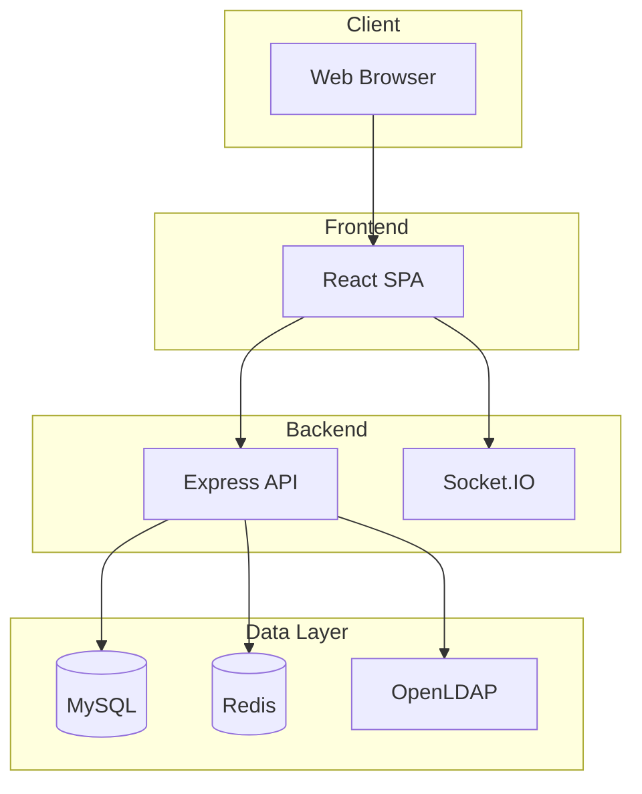

# Documentation Index

---

## RobEurope Platform Documentation

Welcome to the RobEurope documentation. This index provides quick access to all available documentation for the platform.

---

## Quick Start

1. Read the [main README](../README.md) for project overview
2. Follow the [installation guide](../README.md#installation) to set up locally
3. Review the [architecture](architecture.md) to understand the system

---

## Documentation Structure

### General Documentation

| Document | Description |
|----------|-------------|
| [README](../README.md) | Project overview, quick start, and basic information |
| [Architecture](architecture.md) | System design, components, and technology decisions |
| [Contributing](contributing.md) | Guidelines for contributing to the project |

### Technical Documentation

| Document | Description |
|----------|-------------|
| [Backend Guide](backend.md) | Express.js API development, controllers, middleware |
| [Frontend Guide](frontend.md) | React application, components, hooks, state management |
| [Database Schema](database.md) | ERD diagrams, models, relationships, migrations |
| [API Reference](api.md) | REST endpoints, request/response formats, WebSocket events |

### Operations Documentation

| Document | Description |
|----------|-------------|
| [Deployment Guide](deployment.md) | Production deployment, server setup, configuration |
| [Security](security.md) | Authentication, authorization, security best practices |

### Visual Documentation

| Document | Description |
|----------|-------------|
| [System Diagrams](diagrams.md) | ERD, class diagrams, sequence diagrams, state machines |

---

## Architecture Overview

---

## Key Features Documentation

### Authentication

- [Password Authentication](security.md#password-authentication)
- [OAuth Integration](security.md#oauth-20-integration)
- [Session Management](security.md#session-management)
- [LDAP Authentication](security.md#ldap-security)

### API Development

- [Route Structure](backend.md#routing)
- [Controllers](backend.md#controllers)
- [Middleware](backend.md#middleware)
- [API Endpoints](api.md#endpoints)

### Frontend Development

- [Component Structure](frontend.md#components)
- [State Management](frontend.md#state-management)
- [Custom Hooks](frontend.md#hooks)
- [Routing](frontend.md#routing)

### Database

- [Entity Relationship Diagram](database.md#entity-relationship-diagram)
- [Models Reference](database.md#models-reference)
- [Migrations](database.md#migrations)

---

## Diagrams Quick Reference

### Available Diagrams

| Diagram Type | Location |
|--------------|----------|
| Complete ERD | [diagrams.md#entity-relationship-diagram](diagrams.md#entity-relationship-diagram) |
| Class Diagrams | [diagrams.md#class-diagrams](diagrams.md#class-diagrams) |
| Sequence Diagrams | [diagrams.md#sequence-diagrams](diagrams.md#sequence-diagrams) |
| State Diagrams | [diagrams.md#state-diagrams](diagrams.md#state-diagrams) |
| Component Diagrams | [diagrams.md#component-diagrams](diagrams.md#component-diagrams) |
| Use Case Diagrams | [diagrams.md#use-case-diagrams](diagrams.md#use-case-diagrams) |
| Deployment Diagram | [diagrams.md#deployment-diagram](diagrams.md#deployment-diagram) |

---

## Technology Stack Reference

### Backend Technologies

| Technology | Documentation |
|------------|---------------|
| Node.js | [nodejs.org](https://nodejs.org/docs/) |
| Express.js | [expressjs.com](https://expressjs.com/) |
| Sequelize | [sequelize.org](https://sequelize.org/docs/) |
| Socket.IO | [socket.io](https://socket.io/docs/) |
| Passport.js | [passportjs.org](http://www.passportjs.org/docs/) |

### Frontend Technologies

| Technology | Documentation |
|------------|---------------|
| React | [react.dev](https://react.dev/) |
| Vite | [vitejs.dev](https://vitejs.dev/guide/) |
| TailwindCSS | [tailwindcss.com](https://tailwindcss.com/docs) |
| React Router | [reactrouter.com](https://reactrouter.com/) |
| Radix UI | [radix-ui.com](https://www.radix-ui.com/docs) |

### Infrastructure

| Technology | Documentation |
|------------|---------------|
| Docker | [docs.docker.com](https://docs.docker.com/) |
| MySQL | [dev.mysql.com](https://dev.mysql.com/doc/) |
| Redis | [redis.io](https://redis.io/docs/) |
| OpenLDAP | [openldap.org](https://www.openldap.org/doc/) |
| Nginx | [nginx.org](https://nginx.org/en/docs/) |

---

## Getting Help

- **Code Questions**: Check the [DeepWiki](https://deepwiki.com/s-pl/RobEurope)
- **Issues**: Open an issue on [GitHub](https://github.com/s-pl/RobEurope/issues)
- **Contributing**: Read [contributing.md](contributing.md)

---

## License

This documentation is part of the RobEurope project, licensed under MIT.
