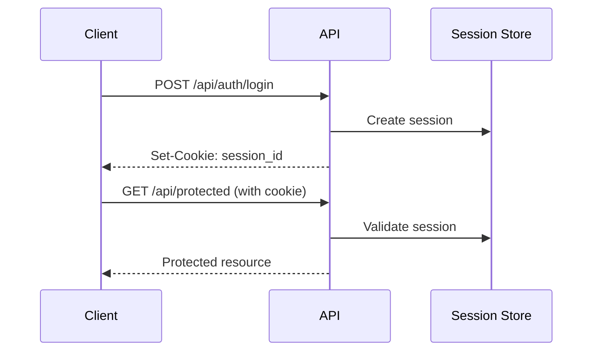

# API Reference

[](https://swagger.io/)
[](https://restfulapi.net/)
[](https://www.json.org/)

---

## Table of Contents

- [Overview](#overview)
- [Base URL](#base-url)
- [Authentication](#authentication)
- [Error Handling](#error-handling)
- [Endpoints](#endpoints)
  - [Auth](#auth)
  - [Users](#users)
  - [Teams](#teams)
  - [Competitions](#competitions)
  - [Registrations](#registrations)
  - [Posts](#posts)
  - [Notifications](#notifications)
  - [Streams](#streams)
  - [Gallery](#gallery)
  - [Sponsors](#sponsors)
  - [Countries](#countries)
  - [System Logs](#system-logs)
- [WebSocket Events](#websocket-events)

---

## Overview

The RobEurope API is a RESTful API that provides access to all platform functionality. All responses are in JSON format.

### Interactive Documentation

Access the Swagger UI documentation at:

```
http://localhost:85/api-docs
```

---

## Base URL

```
Development: http://localhost:85/api
Production:  https://api.robeurope.samuelponce.es/api
```

---

## Authentication

The API uses cookie-based session authentication. After successful login, a session cookie is set automatically.

### Session Flow



### Protected Routes

Routes requiring authentication return `401 Unauthorized` if no valid session exists.

```json
{
  "error": "Unauthorized: Session required"
}
```

---

## Error Handling

### Error Response Format

```json
{
  "error": "Error message description"
}
```

### HTTP Status Codes

| Code | Meaning |
|------|---------|
| 200 | Success |
| 201 | Created |
| 400 | Bad Request - Invalid input |
| 401 | Unauthorized - No session |
| 403 | Forbidden - Insufficient permissions |
| 404 | Not Found - Resource doesn't exist |
| 409 | Conflict - Duplicate resource |
| 429 | Too Many Requests - Rate limited |
| 500 | Internal Server Error |

---

## Endpoints

### Auth

#### Register User

```http
POST /api/auth/register
```

**Request Body:**

```json
{
  "email": "user@example.com",
  "password": "SecurePass123!",
  "first_name": "John",
  "last_name": "Doe",
  "username": "johndoe",
  "phone": "+34612345678"
}
```

**Response:** `201 Created`

```json
{
  "user": {
    "id": "uuid",
    "email": "user@example.com",
    "first_name": "John",
    "last_name": "Doe",
    "username": "johndoe",
    "role": "user"
  }
}
```

**Validation:**
- Password must be at least 8 characters
- Password must contain 3 of: uppercase, lowercase, number, symbol
- Email must be unique
- Username must be unique

---

#### Login

```http
POST /api/auth/login
```

**Request Body:**

```json
{
  "email": "user@example.com",
  "password": "SecurePass123!"
}
```

**Response:** `200 OK`

```json
{
  "user": {
    "id": "uuid",
    "email": "user@example.com",
    "first_name": "John",
    "last_name": "Doe",
    "username": "johndoe",
    "role": "user"
  }
}
```

---

#### Logout

```http
POST /api/auth/logout
```

**Response:** `200 OK`

```json
{
  "message": "Logged out successfully"
}
```

---

#### Request Password Reset

```http
POST /api/auth/forgot-password
```

**Request Body:**

```json
{
  "email": "user@example.com"
}
```

**Response:** `200 OK`

```json
{
  "message": "If the email exists, a reset code has been sent"
}
```

---

#### Reset Password

```http
POST /api/auth/reset-password
```

**Request Body:**

```json
{
  "email": "user@example.com",
  "code": "123456",
  "newPassword": "NewSecurePass123!"
}
```

**Response:** `200 OK`

```json
{
  "message": "Password reset successfully"
}
```

---

#### Get Current User

```http
GET /api/whoami
```

**Auth Required:** Yes

**Response:** `200 OK`

```json
{
  "user": {
    "id": "uuid",
    "email": "user@example.com",
    "first_name": "John",
    "last_name": "Doe",
    "username": "johndoe",
    "role": "user"
  }
}
```

---

### Users

#### Get All Users

```http
GET /api/users
```

**Query Parameters:**

| Parameter | Type | Description |
|-----------|------|-------------|
| limit | number | Max results (default: 50) |
| offset | number | Pagination offset |
| search | string | Search by name/email |

**Response:** `200 OK`

```json
{
  "users": [
    {
      "id": "uuid",
      "first_name": "John",
      "last_name": "Doe",
      "username": "johndoe",
      "email": "john@example.com",
      "profile_photo_url": "/uploads/avatars/user.jpg",
      "bio": "Robotics enthusiast",
      "created_at": "2025-01-01T00:00:00Z"
    }
  ],
  "total": 100
}
```

---

#### Get User by ID

```http
GET /api/users/:id
```

**Response:** `200 OK`

```json
{
  "id": "uuid",
  "first_name": "John",
  "last_name": "Doe",
  "username": "johndoe",
  "email": "john@example.com",
  "phone": "+34612345678",
  "bio": "Robotics enthusiast",
  "profile_photo_url": "/uploads/avatars/user.jpg",
  "country_id": 1,
  "Country": {
    "id": 1,
    "name": "Spain",
    "code": "ES"
  },
  "created_at": "2025-01-01T00:00:00Z"
}
```

---

#### Update User Profile

```http
PUT /api/users/:id
```

**Auth Required:** Yes (owner or admin)

**Request Body:**

```json
{
  "first_name": "John",
  "last_name": "Doe",
  "bio": "Updated bio",
  "phone": "+34612345678",
  "country_id": 1
}
```

**Response:** `200 OK`

---

#### Upload Profile Photo

```http
POST /api/users/:id/avatar
```

**Auth Required:** Yes (owner)

**Content-Type:** `multipart/form-data`

| Field | Type | Description |
|-------|------|-------------|
| avatar | file | Image file (JPEG, PNG) |

**Response:** `200 OK`

```json
{
  "profile_photo_url": "/uploads/avatars/uuid-filename.jpg"
}
```

---

### Teams

#### Get All Teams

```http
GET /api/teams
```

**Query Parameters:**

| Parameter | Type | Description |
|-----------|------|-------------|
| country_id | number | Filter by country |
| search | string | Search by name |

**Response:** `200 OK`

```json
{
  "teams": [
    {
      "id": 1,
      "name": "RoboTeam",
      "city": "Madrid",
      "institution": "Universidad Politecnica",
      "description": "Competition robotics team",
      "logo_url": "/uploads/teams/logo.jpg",
      "website_url": "https://roboteam.com",
      "Country": {
        "id": 1,
        "name": "Spain",
        "code": "ES"
      },
      "members_count": 5
    }
  ]
}
```

---

#### Get Team by ID

```http
GET /api/teams/:id
```

**Response:** `200 OK`

```json
{
  "id": 1,
  "name": "RoboTeam",
  "city": "Madrid",
  "institution": "Universidad Politecnica",
  "description": "Competition robotics team",
  "logo_url": "/uploads/teams/logo.jpg",
  "website_url": "https://roboteam.com",
  "social_links": {
    "twitter": "https://twitter.com/roboteam",
    "github": "https://github.com/roboteam"
  },
  "Country": { "id": 1, "name": "Spain", "code": "ES" },
  "creator": { "id": "uuid", "username": "creator" },
  "members": [
    {
      "id": "uuid",
      "username": "member1",
      "role": "leader",
      "joined_at": "2025-01-01T00:00:00Z"
    }
  ],
  "created_at": "2025-01-01T00:00:00Z"
}
```

---

#### Create Team

```http
POST /api/teams
```

**Auth Required:** Yes

**Request Body:**

```json
{
  "name": "New Team",
  "city": "Barcelona",
  "institution": "Universitat de Barcelona",
  "description": "Our robotics team",
  "country_id": 1,
  "website_url": "https://newteam.com"
}
```

**Response:** `201 Created`

---

#### Update Team

```http
PUT /api/teams/:id
```

**Auth Required:** Yes (team leader or admin)

---

#### Delete Team

```http
DELETE /api/teams/:id
```

**Auth Required:** Yes (team leader or admin)

---

#### Invite Member

```http
POST /api/teams/:id/invite
```

**Auth Required:** Yes (team leader)

**Request Body:**

```json
{
  "email": "newmember@example.com"
}
```

or

```json
{
  "user_id": "uuid"
}
```

**Response:** `201 Created`

```json
{
  "invite": {
    "id": "uuid",
    "token": "invite-token",
    "status": "pending",
    "expires_at": "2025-01-08T00:00:00Z"
  }
}
```

---

#### Accept Invite

```http
POST /api/teams/accept-invite
```

**Auth Required:** Yes

**Request Body:**

```json
{
  "token": "invite-token"
}
```

---

### Competitions

#### Get All Competitions

```http
GET /api/competitions
```

**Query Parameters:**

| Parameter | Type | Description |
|-----------|------|-------------|
| status | string | Filter by status (draft, published, archived) |
| active | boolean | Filter active only |

**Response:** `200 OK`

```json
{
  "competitions": [
    {
      "id": 1,
      "title": "RoboCup Europe 2025",
      "slug": "robocup-europe-2025",
      "description": "Annual robotics competition",
      "status": "published",
      "location": "Madrid, Spain",
      "max_teams": 50,
      "registration_start": "2025-01-01T00:00:00Z",
      "registration_end": "2025-02-01T00:00:00Z",
      "start_date": "2025-03-15T00:00:00Z",
      "end_date": "2025-03-17T00:00:00Z",
      "is_active": true,
      "registered_teams": 25
    }
  ]
}
```

---

#### Get Competition by ID

```http
GET /api/competitions/:id
```

**Response:** `200 OK`

```json
{
  "id": 1,
  "title": "RoboCup Europe 2025",
  "slug": "robocup-europe-2025",
  "description": "Annual robotics competition",
  "status": "published",
  "location": "Madrid, Spain",
  "max_teams": 50,
  "registration_start": "2025-01-01T00:00:00Z",
  "registration_end": "2025-02-01T00:00:00Z",
  "start_date": "2025-03-15T00:00:00Z",
  "end_date": "2025-03-17T00:00:00Z",
  "rules_url": "https://example.com/rules.pdf",
  "is_active": true,
  "stream_url": ["https://youtube.com/live/xxx"],
  "streams": [],
  "registrations": []
}
```

---

### Registrations

#### Get Registrations

```http
GET /api/registrations
```

**Auth Required:** Yes

**Query Parameters:**

| Parameter | Type | Description |
|-----------|------|-------------|
| team_id | number | Filter by team |
| competition_id | number | Filter by competition |
| status | string | Filter by status |

---

#### Create Registration

```http
POST /api/registrations
```

**Auth Required:** Yes (team leader)

**Request Body:**

```json
{
  "team_id": 1,
  "competition_id": 1
}
```

**Response:** `201 Created`

```json
{
  "registration": {
    "id": 1,
    "team_id": 1,
    "competition_id": 1,
    "status": "pending",
    "registration_date": "2025-01-14T00:00:00Z"
  }
}
```

---

#### Update Registration Status (Admin)

```http
PATCH /api/registrations/:id
```

**Auth Required:** Yes (admin)

**Request Body:**

```json
{
  "status": "approved",
  "decision_reason": "Team meets all requirements"
}
```

---

### Posts

#### Get All Posts

```http
GET /api/posts
```

**Query Parameters:**

| Parameter | Type | Description |
|-----------|------|-------------|
| limit | number | Max results |
| offset | number | Pagination |
| pinned | boolean | Filter pinned only |

**Response:** `200 OK`

```json
{
  "posts": [
    {
      "id": 1,
      "title": "Competition Announcement",
      "content": "Post content here...",
      "author": {
        "id": "uuid",
        "username": "admin",
        "profile_photo_url": "/uploads/avatars/admin.jpg"
      },
      "media_urls": ["/uploads/posts/image.jpg"],
      "likes_count": 42,
      "views_count": 150,
      "is_pinned": true,
      "created_at": "2025-01-14T00:00:00Z",
      "comments_count": 5
    }
  ],
  "total": 100
}
```

---

#### Get Post by ID

```http
GET /api/posts/:id
```

---

#### Create Post

```http
POST /api/posts
```

**Auth Required:** Yes

**Request Body:**

```json
{
  "title": "New Post Title",
  "content": "Post content with **markdown** support"
}
```

---

#### Like Post

```http
POST /api/posts/:id/like
```

**Auth Required:** Yes

---

#### Unlike Post

```http
DELETE /api/posts/:id/like
```

**Auth Required:** Yes

---

#### Add Comment

```http
POST /api/posts/:id/comments
```

**Auth Required:** Yes

**Request Body:**

```json
{
  "content": "Great post!"
}
```

---

### Notifications

#### Get User Notifications

```http
GET /api/notifications
```

**Auth Required:** Yes

**Query Parameters:**

| Parameter | Type | Description |
|-----------|------|-------------|
| unread | boolean | Filter unread only |

**Response:** `200 OK`

```json
{
  "notifications": [
    {
      "id": "uuid",
      "title": "Team Invitation",
      "message": "You have been invited to join RoboTeam",
      "type": "team_invite",
      "meta": {
        "kind": "team_invite",
        "team_id": 1,
        "team_name": "RoboTeam",
        "invite_token": "xxx"
      },
      "is_read": false,
      "created_at": "2025-01-14T00:00:00Z"
    }
  ]
}
```

---

#### Mark as Read

```http
PATCH /api/notifications/:id/read
```

**Auth Required:** Yes

---

#### Mark All as Read

```http
PATCH /api/notifications/read-all
```

**Auth Required:** Yes

---

### Streams

#### Get All Streams

```http
GET /api/streams
```

**Query Parameters:**

| Parameter | Type | Description |
|-----------|------|-------------|
| status | string | offline, scheduled, live |
| competition_id | number | Filter by competition |
| team_id | number | Filter by team |

---

#### Get Stream by ID

```http
GET /api/streams/:id
```

---

#### Create Stream

```http
POST /api/streams
```

**Auth Required:** Yes (team member)

**Request Body:**

```json
{
  "title": "Live Robot Testing",
  "description": "Testing our competition robot",
  "stream_url": "https://youtube.com/live/xxx",
  "team_id": 1,
  "competition_id": 1,
  "status": "scheduled"
}
```

---

### Gallery

#### Get Gallery Items

```http
GET /api/gallery
```

**Query Parameters:**

| Parameter | Type | Description |
|-----------|------|-------------|
| limit | number | Max results |
| offset | number | Pagination |

---

#### Upload Image

```http
POST /api/gallery
```

**Auth Required:** Yes

**Content-Type:** `multipart/form-data`

| Field | Type | Description |
|-------|------|-------------|
| image | file | Image file |
| title | string | Image title |
| description | string | Image description |

---

### Sponsors

#### Get All Sponsors

```http
GET /api/sponsors
```

**Response:** `200 OK`

```json
{
  "sponsors": [
    {
      "id": 1,
      "name": "Tech Corp",
      "logo_url": "/uploads/sponsors/techcorp.png",
      "website_url": "https://techcorp.com"
    }
  ]
}
```

---

### Countries

#### Get All Countries

```http
GET /api/countries
```

**Response:** `200 OK`

```json
{
  "countries": [
    {
      "id": 1,
      "name": "Spain",
      "code": "ES",
      "flag_emoji": "🇪🇸"
    }
  ]
}
```

---

### System Logs

#### Get System Logs (Admin)

```http
GET /api/system-logs
```

**Auth Required:** Yes (admin)

**Query Parameters:**

| Parameter | Type | Description |
|-----------|------|-------------|
| user_id | uuid | Filter by user |
| action | string | Filter by action type |
| entity_type | string | Filter by entity |
| start_date | date | From date |
| end_date | date | To date |

---

## WebSocket Events

### Connection

```javascript
const socket = io('http://localhost:85', {
  transports: ['websocket', 'polling']
});
```

### Events

| Event | Direction | Payload | Description |
|-------|-----------|---------|-------------|
| `join:team` | Client -> Server | `teamId` | Join team room |
| `leave:team` | Client -> Server | `teamId` | Leave team room |
| `team:message` | Bidirectional | `{ teamId, content, userId }` | Team chat |
| `file:edit` | Bidirectional | `{ teamId, fileId, changes }` | Collaborative editing |
| `notification:new` | Server -> Client | Notification object | New notification |
| `stream:status` | Server -> Client | `{ streamId, status }` | Stream status change |

### Example Usage

```javascript
// Join team room
socket.emit('join:team', teamId);

// Listen for team messages
socket.on('team:message', (message) => {
  console.log('New message:', message);
});

// Send team message
socket.emit('team:message', {
  teamId: 1,
  content: 'Hello team!',
  userId: currentUser.id
});

// Listen for notifications
socket.on('notification:new', (notification) => {
  showToast(notification);
});
```

---

## Rate Limiting

The API implements rate limiting to prevent abuse:

| Endpoint | Limit |
|----------|-------|
| General API | 100 requests / 15 minutes |
| Auth endpoints | 10 requests / 15 minutes |
| File uploads | 20 requests / hour |

When rate limited, the API returns:

```json
{
  "error": "Too many requests, please try again later"
}
```

---

## Related Documentation

- [Backend Guide](backend.md)
- [Architecture Overview](architecture.md)
- [Database Schema](database.md)
