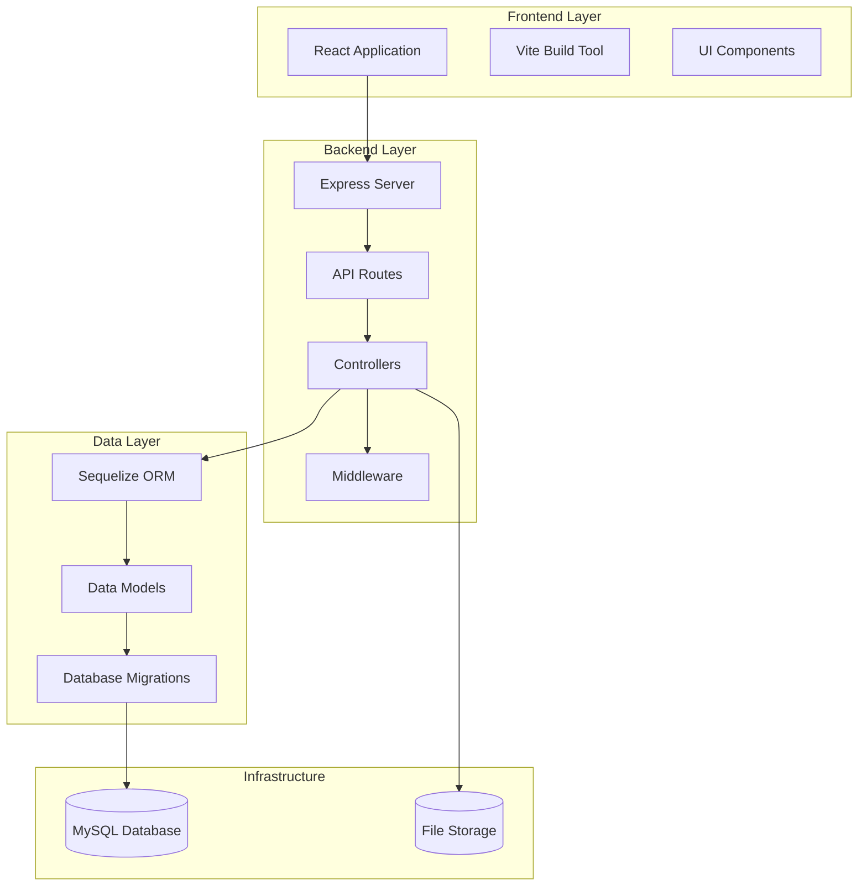

# System Architecture

## Overview

RobEurope follows a modular, layered architecture designed for scalability and maintainability. The system is built using modern web development practices with clear separation of concerns.

## Architecture Layers

### 1. Presentation Layer (Frontend)
- **Technology**: React with Vite
- **Purpose**: User interface and interaction
- **Components**:
  - React components for UI elements
  - State management
  - API communication
  - Routing

### 2. Application Layer (Backend)
- **Technology**: Node.js with Express.js
- **Purpose**: Business logic and API endpoints
- **Components**:
  - Route handlers
  - Controllers
  - Middleware
  - Business logic services

### 3. Data Access Layer
- **Technology**: Sequelize ORM
- **Purpose**: Database abstraction and queries
- **Components**:
  - Models
  - Migrations
  - Seeders
  - Database connections

### 4. Infrastructure Layer
- **Technology**: MySQL, File System
- **Purpose**: Data persistence and storage
- **Components**:
  - Database server
  - File storage
  - External services

## Component Diagram

## Data Flow

### User Request Flow
1. User interacts with React frontend
2. Frontend makes HTTP request to API
3. Express server receives request
4. Middleware processes authentication/authorization
5. Route handler delegates to controller
6. Controller executes business logic
7. Controller interacts with Sequelize models
8. Models execute database queries
9. Response flows back through the layers
10. Frontend receives and displays data

### File Upload Flow
1. User selects file in frontend
2. Frontend sends multipart/form-data to API
3. Multer middleware processes file upload
4. File is stored in local file system
5. File URL is stored in related database records
6. File URL is returned to frontend

## Security Architecture

### Authentication
- JWT-based token authentication
- Password hashing with bcryptjs
- Token expiration and refresh mechanisms

### Authorization
- Role-based access control (RBAC)
- Route-level middleware protection
- Super admin privileges for system management

### Data Protection
- Input validation and sanitization
- SQL injection prevention through ORM
- CORS configuration
- Rate limiting

