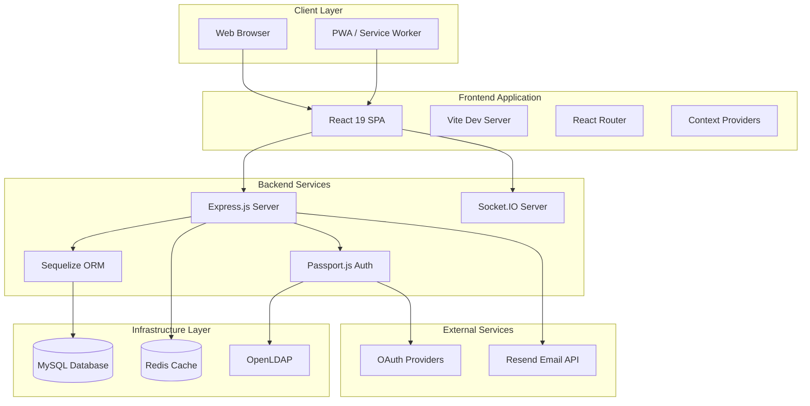
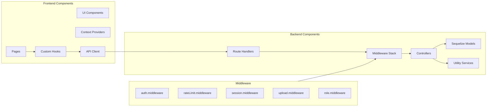
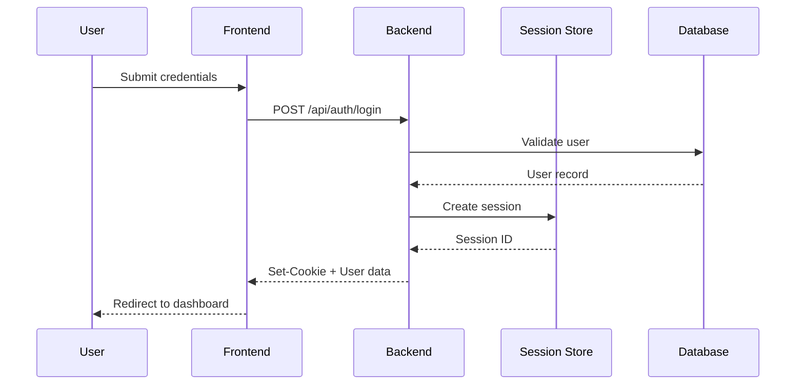
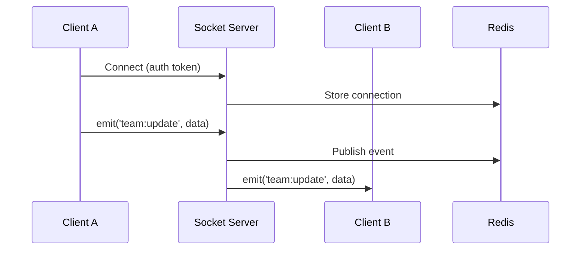
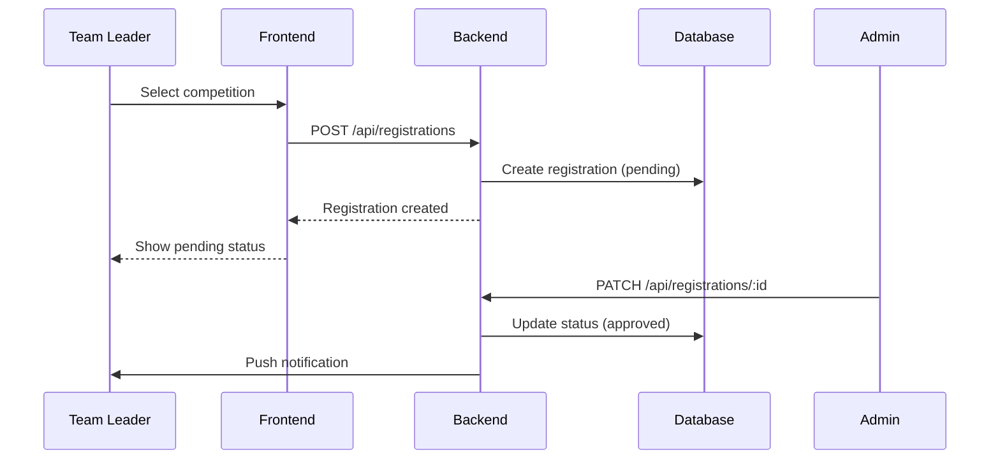
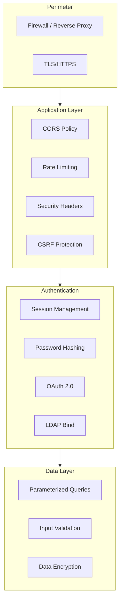
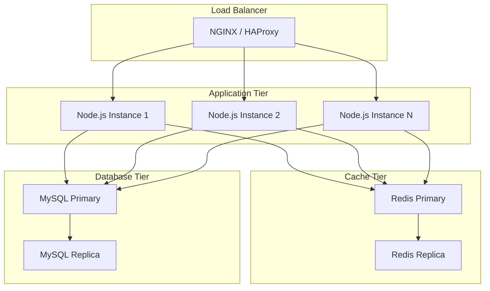

# Architecture Overview

[](https://nodejs.org/)
[](https://expressjs.com/)
[](https://reactjs.org/)
[](https://www.mysql.com/)

---

## Table of Contents

- [System Overview](#system-overview)
- [High-Level Architecture](#high-level-architecture)
- [Component Diagram](#component-diagram)
- [Data Flow](#data-flow)
- [Technology Decisions](#technology-decisions)
- [Security Architecture](#security-architecture)
- [Scalability Considerations](#scalability-considerations)

---

## System Overview

RobEurope is built as a monorepo containing two main applications: a Node.js/Express backend API and a React/Vite frontend SPA. The system follows a client-server architecture with additional infrastructure services for authentication, caching, and real-time communication.

### Core Principles

1. **Separation of Concerns**: Clear boundaries between frontend, backend, and infrastructure
2. **RESTful Design**: API follows REST conventions with consistent resource naming
3. **Real-time Capabilities**: Socket.IO enables live updates and collaborative features
4. **Security First**: Session-based auth, CSRF protection, rate limiting, and LDAP integration

---

## High-Level Architecture



---

## Component Diagram



---

## Data Flow

### Authentication Flow



### Real-time Updates Flow



### Competition Registration Flow



---

## Technology Decisions

### Backend Stack

| Component | Technology | Rationale |
|-----------|------------|-----------|
| Runtime | Node.js 18+ | Non-blocking I/O, JavaScript ecosystem |
| Framework | Express.js | Mature, flexible, extensive middleware |
| ORM | Sequelize | Active record pattern, migrations support |
| Real-time | Socket.IO | Fallback transports, room management |
| Auth | Passport.js | Strategy pattern, OAuth integration |

### Frontend Stack

| Component | Technology | Rationale |
|-----------|------------|-----------|
| Library | React 19 | Component model, hooks, ecosystem |
| Build Tool | Vite | Fast HMR, ESM-native, optimized builds |
| Styling | TailwindCSS | Utility-first, no CSS conflicts |
| State | React Context | Built-in, sufficient for app scope |
| Routing | React Router | Declarative, nested routes |

### Infrastructure

| Component | Technology | Rationale |
|-----------|------------|-----------|
| Database | MySQL 8 | ACID compliance, relational integrity |
| Cache | Redis | Session storage, pub/sub, fast access |
| Directory | OpenLDAP | Enterprise directory, standards compliant |
| Containers | Docker | Reproducible environments |

---

## Security Architecture

### Defense Layers



### Security Measures

1. **Transport Security**: All production traffic over HTTPS
2. **Session Management**: HTTP-only cookies, secure flag, SameSite policy
3. **Password Storage**: bcrypt with cost factor 10
4. **Input Validation**: Server-side validation on all inputs
5. **Rate Limiting**: Request throttling per IP and user
6. **CORS**: Allowlist-based origin validation
7. **Headers**: Helmet middleware for security headers

---

## Scalability Considerations

### Current Architecture Limits

- Single server deployment
- Session storage in Redis (horizontal scaling ready)
- Database connection pooling via Sequelize

### Future Scaling Path



### Scaling Strategies

1. **Horizontal Scaling**: Add Node.js instances behind load balancer
2. **Session Affinity**: Redis enables stateless Node.js instances
3. **Database Read Replicas**: Offload read queries
4. **CDN**: Static asset delivery via CDN
5. **Queue System**: Background job processing for heavy tasks

---

## Directory Structure

```
RobEurope/
├── backend/
│   ├── config/           # Configuration files
│   ├── controller/       # Request handlers
│   ├── middleware/       # Express middleware
│   ├── migrations/       # Database migrations
│   ├── models/           # Sequelize models
│   ├── routes/           # API route definitions
│   ├── seeders/          # Database seeders
│   ├── utils/            # Helper functions
│   ├── views/            # EJS templates
│   └── index.js          # Application entry point
├── frontend/
│   ├── public/           # Static assets
│   └── src/
│       ├── components/   # React components
│       ├── context/      # Context providers
│       ├── hooks/        # Custom hooks
│       ├── lib/          # Utilities
│       └── pages/        # Route components
├── docs/                 # Documentation
└── docker-compose.yml    # Infrastructure
```

---

## Related Documentation

- [Backend Guide](backend.md)
- [Frontend Guide](frontend.md)
- [Database Schema](database.md)
- [API Reference](api.md)
- [Deployment Guide](deployment.md)
