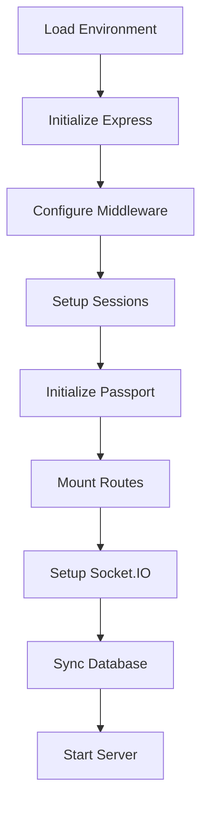
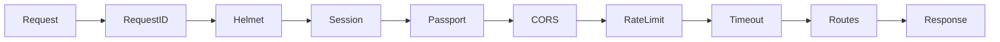

# Backend Documentation

[](https://nodejs.org/)
[](https://expressjs.com/)
[](https://sequelize.org/)
[](https://socket.io/)
[](https://vitest.dev/)

---

## Table of Contents

- [Overview](#overview)
- [Directory Structure](#directory-structure)
- [Application Entry Point](#application-entry-point)
- [Configuration](#configuration)
- [Routing](#routing)
- [Controllers](#controllers)
- [Middleware](#middleware)
- [Models](#models)
- [Services and Utilities](#services-and-utilities)
- [Real-time Communication](#real-time-communication)
- [Testing](#testing)

---

## Overview

The backend is a Node.js application built with Express.js, providing a RESTful API for the RobEurope platform. It handles authentication, data persistence, real-time communication, and administrative functions.

### Key Features

- RESTful API design
- Session-based authentication with Redis storage
- OAuth integration (Google, GitHub, Apple)
- LDAP directory integration
- Real-time updates via Socket.IO
- Push notifications (Web Push API)
- File upload handling
- Comprehensive logging
- Rate limiting and security middleware

---

## Directory Structure

```
backend/
├── __tests__/           # Test suites
├── certs/               # SSL certificates
├── config/              # Configuration modules
│   ├── db.config.js     # Database configuration
│   ├── i18n.js          # Internationalization setup
│   └── passport.js      # Passport strategies
├── controller/          # Request handlers
├── locales/             # Translation files
├── logs/                # Application logs
├── middleware/          # Express middleware
├── migrations/          # Database migrations
├── models/              # Sequelize models
├── public/              # Static files
├── routes/              # Route definitions
│   ├── admin.route.js   # Admin panel routes
│   └── api/             # API endpoints
├── scripts/             # Utility scripts
├── seeders/             # Database seeders
├── uploads/             # User uploads
├── utils/               # Helper functions
├── views/               # EJS templates
├── index.js             # Application entry
├── swagger.js           # API documentation
└── package.json         # Dependencies
```

---

## Application Entry Point

The main entry point is [index.js](../backend/index.js), which configures and starts the Express server.

### Initialization Sequence



### Server Configuration

```javascript
// Key middleware setup order
app.use(helmet());                    // Security headers
app.use(requestId());                 // Request tracking
app.use(session({ store: redisStore })); // Sessions
app.use(passport.initialize());       // Auth
app.use(passport.session());
app.use(morgan());                    // Logging
app.use(cors(corsOptions));           // CORS for API
app.use(express.json());              // Body parsing
app.use(rateLimit);                   // Rate limiting
```

---

## Configuration

### Environment Variables

```env
# Server
PORT=85
NODE_ENV=development|production

# Database
DB_HOST=localhost
DB_PORT=3306
DB_NAME=robeurope
DB_USER=root
DB_PASS=secret

# Security
JWT_SECRET=your-jwt-secret
SESSION_SECRET=your-session-secret

# LDAP
LDAP_URL=ldap://localhost:389
LDAP_BIND_DN=cn=admin,dc=example,dc=com
LDAP_BIND_PASSWORD=password
LDAP_BASE_DN=dc=example,dc=com
LDAP_USER_DN=ou=users

# Redis
REDIS_URL=redis://localhost:6379

# Email
RESEND_API_KEY=re_xxxxx

# Push Notifications
VAPID_PUBLIC_KEY=xxxxx
VAPID_PRIVATE_KEY=xxxxx
```

### Database Configuration

Located in `config/db.config.js`:

```javascript
export default {
  development: {
    username: process.env.DB_USER,
    password: process.env.DB_PASS,
    database: process.env.DB_NAME,
    host: process.env.DB_HOST,
    dialect: 'mysql',
    logging: console.log
  },
  production: {
    // Production settings
    logging: false
  }
};
```

### Passport Configuration

Located in `config/passport.js`, configures authentication strategies:

- Local strategy (email/password)
- Google OAuth 2.0
- GitHub OAuth 2.0
- Apple Sign In
- LDAP authentication

---

## Routing

### Route Organization

Routes are organized by domain and mounted in `routes/api/index.js`:

```javascript
// Public routes
router.use('/auth', authRouter);
router.use('/posts', postsRouter);
router.use('/countries', countriesRouter);
router.use('/users', usersRouter);
router.use('/streams', streamsRouter);
router.use('/competitions', competitionsRouter);
router.use('/sponsors', sponsorsRouter);
router.use('/teams', teamsRouter);
router.use('/team-members', teamMembersRouter);
router.use('/gallery', galleryRouter);

// Protected routes (after auth middleware)
router.use(authenticateToken);
router.use('/notifications', notificationsRouter);
router.use('/registrations', registrationRouter);
router.use('/system-logs', systemLogRouter);
router.use('/robot-files', robotFilesRouter);
router.use('/team-logs', teamLogsRouter);
router.use('/admin', adminApiRouter);
```

### Route Files

| File | Base Path | Description |
|------|-----------|-------------|
| `auth.route.js` | `/api/auth` | Authentication endpoints |
| `user.route.js` | `/api/users` | User management |
| `teams.route.js` | `/api/teams` | Team operations |
| `competitions.route.js` | `/api/competitions` | Competition data |
| `posts.route.js` | `/api/posts` | Blog posts |
| `notifications.route.js` | `/api/notifications` | User notifications |
| `registrations.route.js` | `/api/registrations` | Competition signup |
| `stream.route.js` | `/api/streams` | Live streams |
| `sponsors.route.js` | `/api/sponsors` | Sponsor info |
| `gallery.route.js` | `/api/gallery` | Media gallery |
| `robot_file.route.js` | `/api/robot-files` | Robot code files |
| `system_log.route.js` | `/api/system-logs` | Audit logs |

---

## Controllers

Controllers contain business logic for handling requests. Each controller corresponds to a domain entity.

### Controller Pattern

```javascript
// Example: auth.controller.js
export const register = async (req, res) => {
  try {
    // 1. Validate input
    const { email, password, first_name, last_name, username } = req.body;
    if (!email || !password) {
      return res.status(400).json({ error: 'Missing required fields' });
    }

    // 2. Business logic
    const existingUser = await User.findOne({ where: { email } });
    if (existingUser) {
      return res.status(409).json({ error: 'Email already registered' });
    }

    const password_hash = await bcrypt.hash(password, 10);
    const user = await User.create({ email, password_hash, ... });

    // 3. Session management
    req.session.user = { id: user.id, email: user.email, ... };

    // 4. Logging
    await SystemLogger.logCreate('User', user.id, { ... }, req);

    // 5. Response
    return res.status(201).json({ user: userSession });
  } catch (err) {
    return res.status(500).json({ error: err.message });
  }
};
```

### Controller Files

| Controller | Purpose |
|------------|---------|
| `auth.controller.js` | Login, register, password reset |
| `user.controller.js` | Profile management |
| `teams.controller.js` | Team CRUD |
| `competitions.controller.js` | Competition management |
| `posts.controller.js` | Blog post operations |
| `notifications.controller.js` | Notification handling |
| `registration.controller.js` | Competition registration |
| `admin.controller.js` | Admin panel actions |
| `admin.crud.controller.js` | Generic CRUD for admin |
| `admin.redis.controller.js` | Redis management |
| `ldap.controller.js` | LDAP operations |
| `stream.controller.js` | Stream management |
| `push.controller.js` | Push notifications |
| `media.controller.js` | File uploads |
| `gallery.controller.js` | Gallery management |
| `robot_file.controller.js` | Robot file handling |
| `system_log.controller.js` | Audit logging |
| `team_chat.controller.js` | Team messaging |
| `team_log.controller.js` | Team activity logs |
| `team_members.controller.js` | Team membership |
| `sponsors.controller.js` | Sponsor management |
| `country.controller.js` | Country data |

---

## Middleware

### Middleware Stack



### Middleware Files

#### auth.middleware.js

Validates session authentication:

```javascript
export default function authenticateToken(req, res, next) {
  if (req.session && req.session.user) {
    req.user = req.session.user;
    return next();
  }
  return res.status(401).json({ error: 'Unauthorized: Session required' });
}
```

#### role.middleware.js

Checks user roles for authorization:

```javascript
export function requireRole(...roles) {
  return (req, res, next) => {
    if (!req.user || !roles.includes(req.user.role)) {
      return res.status(403).json({ error: 'Forbidden' });
    }
    next();
  };
}
```

#### rateLimit.middleware.js

Implements request throttling:

```javascript
import rateLimit from 'express-rate-limit';

export default rateLimit({
  windowMs: 15 * 60 * 1000, // 15 minutes
  max: 100,                  // requests per window
  message: { error: 'Too many requests' }
});
```

#### upload.middleware.js

Handles file uploads using Multer:

```javascript
import multer from 'multer';

const storage = multer.diskStorage({
  destination: (req, file, cb) => cb(null, 'uploads/'),
  filename: (req, file, cb) => cb(null, `${Date.now()}-${file.originalname}`)
});

export const upload = multer({ 
  storage,
  limits: { fileSize: 10 * 1024 * 1024 }, // 10MB
  fileFilter: (req, file, cb) => {
    // Validate file types
  }
});
```

#### timeout.middleware.js

Prevents hanging requests:

```javascript
export default function timeoutMiddleware(req, res, next) {
  req.setTimeout(30000); // 30 seconds
  next();
}
```

#### requestId.middleware.js

Adds unique request identifiers for tracing:

```javascript
import { v4 as uuidv4 } from 'uuid';

export default function requestId() {
  return (req, res, next) => {
    req.id = uuidv4();
    res.setHeader('X-Request-ID', req.id);
    next();
  };
}
```

#### ownership.middleware.js

Validates resource ownership:

```javascript
export function checkOwnership(model, paramKey = 'id') {
  return async (req, res, next) => {
    const resource = await model.findByPk(req.params[paramKey]);
    if (!resource) return res.status(404).json({ error: 'Not found' });
    if (resource.user_id !== req.user.id && req.user.role !== 'super_admin') {
      return res.status(403).json({ error: 'Forbidden' });
    }
    req.resource = resource;
    next();
  };
}
```

---

## Models

Models are defined using Sequelize ORM. See [database.md](database.md) for complete schema documentation.

### Model Loading

Models are dynamically loaded in `models/index.js`:

```javascript
const files = fs.readdirSync(__dirname)
  .filter(f => f.endsWith('.model.js') && f !== 'index.js');

for (const file of files) {
  const modelDef = (await import(file)).default;
  const model = await modelDef(sequelize, DataTypes);
  db[model.name] = model;
}

// Run associations
Object.keys(db).forEach(name => {
  if (db[name].associate) db[name].associate(db);
});
```

### Model Example

```javascript
// models/user.model.js
export default async function defineUserModel(sequelize, DataTypes) {
  const User = sequelize.define('User', {
    id: {
      type: DataTypes.UUID,
      defaultValue: DataTypes.UUIDV4,
      primaryKey: true
    },
    email: {
      type: DataTypes.STRING,
      allowNull: false,
      unique: true
    },
    // ... other fields
  });

  User.associate = (models) => {
    User.hasMany(models.Post, { foreignKey: 'author_id' });
    User.belongsTo(models.Country, { foreignKey: 'country_id' });
  };

  return User;
}
```

---

## Services and Utilities

### Utils Directory

| Utility | Purpose |
|---------|---------|
| `logger.js` | Winston logging configuration |
| `redis.js` | Redis client singleton |
| `realtime.js` | Socket.IO instance management |
| `scheduler.js` | Cron job scheduler |
| `systemLogger.js` | Audit log helper |
| `email.js` | Email sending via Resend |

### Logger Configuration

```javascript
// utils/logger.js
import winston from 'winston';
import DailyRotateFile from 'winston-daily-rotate-file';

const logger = winston.createLogger({
  level: 'info',
  format: winston.format.combine(
    winston.format.timestamp(),
    winston.format.json()
  ),
  transports: [
    new DailyRotateFile({
      filename: 'logs/app-%DATE%.log',
      datePattern: 'YYYY-MM-DD',
      maxFiles: '14d'
    }),
    new winston.transports.Console()
  ]
});

export default logger;
```

### Redis Client

```javascript
// utils/redis.js
import { createClient } from 'redis';

const client = createClient({ url: process.env.REDIS_URL });

client.on('error', err => console.error('Redis error:', err));
client.on('connect', () => console.log('Redis connected'));

await client.connect();

export default client;
```

### System Logger

```javascript
// utils/systemLogger.js
import db from '../models/index.js';

class SystemLogger {
  static async logCreate(entityType, entityId, newValues, req, details) {
    await db.SystemLog.create({
      user_id: req.user?.id,
      action: 'CREATE',
      entity_type: entityType,
      entity_id: entityId,
      new_values: newValues,
      ip_address: req.ip,
      user_agent: req.get('user-agent'),
      details
    });
  }

  static async logUpdate(entityType, entityId, oldValues, newValues, req) { ... }
  static async logDelete(entityType, entityId, oldValues, req) { ... }
  static async logLogin(userId, req) { ... }
  static async logLogout(userId, req) { ... }
}

export default SystemLogger;
```

---

## Real-time Communication

### Socket.IO Setup

```javascript
// In index.js
import { Server as SocketIOServer } from 'socket.io';
import { setIO } from './utils/realtime.js';

const io = new SocketIOServer(server, {
  cors: corsOptions,
  transports: ['websocket', 'polling']
});

setIO(io);

io.on('connection', (socket) => {
  // Join team rooms
  socket.on('join:team', (teamId) => {
    socket.join(`team:${teamId}`);
  });

  // Team chat
  socket.on('team:message', async (data) => {
    io.to(`team:${data.teamId}`).emit('team:message', data);
  });

  // Collaborative editing
  socket.on('file:edit', (data) => {
    socket.to(`team:${data.teamId}`).emit('file:edit', data);
  });
});
```

### Event Types

| Event | Direction | Purpose |
|-------|-----------|---------|
| `join:team` | Client -> Server | Join team room |
| `leave:team` | Client -> Server | Leave team room |
| `team:message` | Bidirectional | Team chat message |
| `file:edit` | Bidirectional | Collaborative editing |
| `notification:new` | Server -> Client | Push notification |
| `stream:status` | Server -> Client | Stream state change |

---

## Testing

### Test Framework

Tests are written using Vitest with Supertest for HTTP assertions.

### Running Tests

```bash
# Run all tests
npm test

# Run with verbose output
npm run test:verbose

# Run specific test file
npx vitest run auth.test.js
```

### Test Structure

```javascript
// __tests__/auth.test.js
import { describe, it, expect, beforeAll, afterAll } from 'vitest';
import request from 'supertest';
import app from '../index.js';

describe('Auth API', () => {
  describe('POST /api/auth/register', () => {
    it('should create a new user', async () => {
      const res = await request(app)
        .post('/api/auth/register')
        .send({
          email: 'test@example.com',
          password: 'Test123!',
          first_name: 'Test',
          last_name: 'User',
          username: 'testuser'
        });
      
      expect(res.status).toBe(201);
      expect(res.body.user).toHaveProperty('id');
    });

    it('should reject duplicate email', async () => {
      const res = await request(app)
        .post('/api/auth/register')
        .send({ email: 'existing@example.com', ... });
      
      expect(res.status).toBe(409);
    });
  });
});
```

### Test Files

| Test File | Coverage |
|-----------|----------|
| `auth.test.js` | Authentication flows |
| `user.test.js` | User operations |
| `teams.test.js` | Team management |
| `posts.test.js` | Post CRUD |
| `notifications.test.js` | Notification system |
| `sponsors.test.js` | Sponsor endpoints |
| `country.test.js` | Country data |
| `robot_file.test.js` | File handling |
| `system_logs.test.js` | Audit logging |
| `push.test.js` | Push notifications |
| `admin.session.test.js` | Admin functionality |

---

## Related Documentation

- [API Reference](api.md)
- [Database Schema](database.md)
- [Architecture Overview](architecture.md)
- [Deployment Guide](deployment.md)
