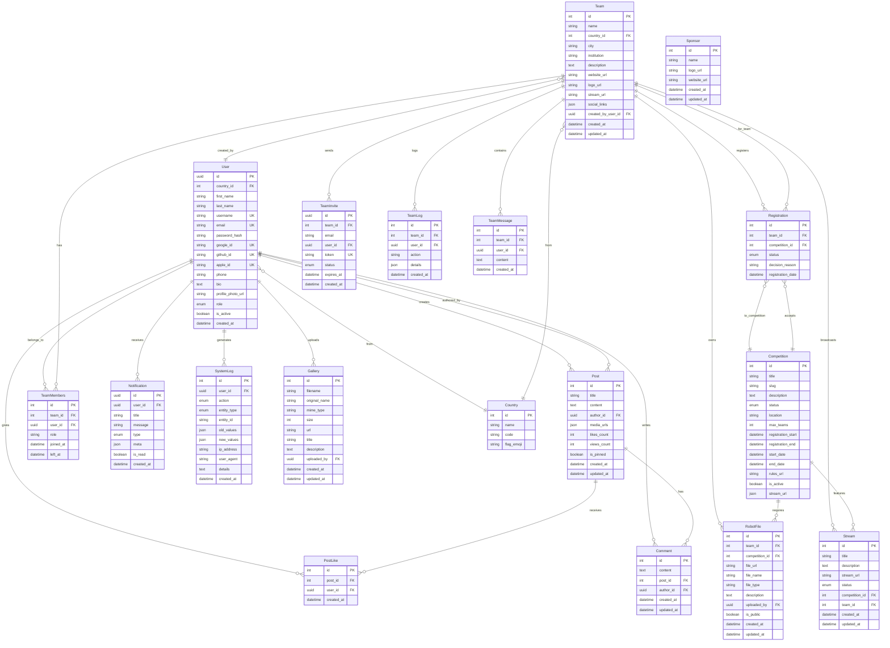
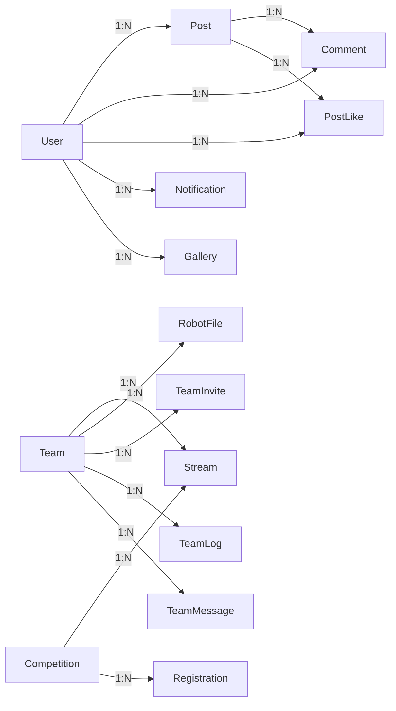
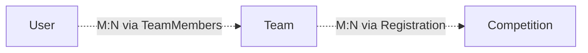

# Database Schema Documentation

[](https://www.mysql.com/)
[](https://sequelize.org/)

---

## Table of Contents

- [Overview](#overview)
- [Entity Relationship Diagram](#entity-relationship-diagram)
- [Models Reference](#models-reference)
- [Relationships](#relationships)
- [Indexes](#indexes)
- [Migrations](#migrations)

---

## Overview

RobEurope uses MySQL as its primary relational database, accessed through Sequelize ORM. The schema is designed to support user management, team collaboration, competition workflows, and content management.

### Database Configuration

```javascript
// backend/config/db.config.js
{
  host: process.env.DB_HOST,
  port: process.env.DB_PORT,
  database: process.env.DB_NAME,
  username: process.env.DB_USER,
  password: process.env.DB_PASS,
  dialect: 'mysql',
  pool: {
    max: 10,
    min: 0,
    acquire: 30000,
    idle: 10000
  }
}
```

---

## Entity Relationship Diagram

### Complete ERD



---

## Models Reference

### User Model

Central entity for authentication and profile management.

| Column | Type | Constraints | Description |
|--------|------|-------------|-------------|
| id | UUID | PK, auto-generated | Unique identifier |
| country_id | INTEGER | FK to Country | User's country |
| first_name | STRING | NOT NULL | First name |
| last_name | STRING | NOT NULL | Last name |
| username | STRING | NOT NULL, UNIQUE | Login username |
| email | STRING | NOT NULL, UNIQUE | Email address |
| password_hash | STRING | NULL | Bcrypt hash (null for OAuth) |
| google_id | STRING | UNIQUE | Google OAuth ID |
| github_id | STRING | UNIQUE | GitHub OAuth ID |
| apple_id | STRING | UNIQUE | Apple OAuth ID |
| phone | STRING | NULL | Phone number |
| bio | TEXT | NULL | User biography |
| profile_photo_url | STRING | NULL | Avatar URL |
| role | ENUM | DEFAULT 'user' | 'user' or 'super_admin' |
| is_active | BOOLEAN | DEFAULT true | Account status |
| created_at | DATETIME | DEFAULT NOW | Registration date |

### Team Model

Represents robotics teams participating in competitions.

| Column | Type | Constraints | Description |
|--------|------|-------------|-------------|
| id | INTEGER | PK, auto-increment | Team ID |
| name | STRING | NOT NULL | Team name |
| country_id | INTEGER | FK to Country | Team's country |
| city | STRING | NULL | City location |
| institution | STRING | NULL | School or organization |
| description | TEXT | NULL | Team description |
| website_url | STRING | NULL | Team website |
| logo_url | STRING | NULL | Team logo |
| stream_url | STRING | NULL | Default stream URL |
| social_links | JSON | NULL | Social media links |
| created_by_user_id | UUID | FK to User | Team creator |
| created_at | DATETIME | DEFAULT NOW | Creation date |
| updated_at | DATETIME | DEFAULT NOW | Last update |

### Competition Model

Defines robotics competitions and events.

| Column | Type | Constraints | Description |
|--------|------|-------------|-------------|
| id | INTEGER | PK, auto-increment | Competition ID |
| title | STRING | NOT NULL | Competition name |
| slug | STRING | NOT NULL | URL-friendly identifier |
| description | TEXT | NULL | Full description |
| status | ENUM | DEFAULT 'draft' | 'draft', 'published', 'archived' |
| location | STRING | NULL | Venue location |
| max_teams | INTEGER | NULL | Maximum participants |
| registration_start | DATETIME | NULL | Registration opens |
| registration_end | DATETIME | NULL | Registration closes |
| start_date | DATETIME | NULL | Event start |
| end_date | DATETIME | NULL | Event end |
| rules_url | STRING | NULL | Rules document link |
| is_active | BOOLEAN | DEFAULT false | Active status |
| stream_url | JSON | NULL | Streaming links |

### Registration Model

Junction table for team competition registrations.

| Column | Type | Constraints | Description |
|--------|------|-------------|-------------|
| id | INTEGER | PK, auto-increment | Registration ID |
| team_id | INTEGER | FK to Team | Registering team |
| competition_id | INTEGER | FK to Competition | Target competition |
| status | ENUM | DEFAULT 'pending' | 'pending', 'approved', 'rejected' |
| decision_reason | STRING | NULL | Admin decision notes |
| registration_date | DATETIME | NOT NULL | Submission date |

### Post Model

Blog posts and news articles.

| Column | Type | Constraints | Description |
|--------|------|-------------|-------------|
| id | INTEGER | PK, auto-increment | Post ID |
| title | STRING | NOT NULL | Post title |
| content | TEXT | NOT NULL | Post body |
| author_id | UUID | FK to User | Author reference |
| media_urls | JSON | NULL | Attached media |
| likes_count | INTEGER | DEFAULT 0 | Like counter |
| views_count | INTEGER | DEFAULT 0 | View counter |
| is_pinned | BOOLEAN | DEFAULT false | Pinned status |
| created_at | DATETIME | DEFAULT NOW | Publication date |
| updated_at | DATETIME | DEFAULT NOW | Last edit |

### Notification Model

In-app user notifications.

| Column | Type | Constraints | Description |
|--------|------|-------------|-------------|
| id | UUID | PK, auto-generated | Notification ID |
| user_id | UUID | FK to User, NOT NULL | Recipient |
| title | STRING | NOT NULL | Notification title |
| message | STRING | NOT NULL | Notification body |
| type | ENUM | NOT NULL | Notification category |
| meta | JSON | NULL | Additional data |
| is_read | BOOLEAN | DEFAULT false | Read status |
| created_at | DATETIME | DEFAULT NOW | Creation time |

**Notification Types:**
- `registration_team_status` - Registration approval/rejection
- `team_invite` - Team invitation
- `mention` - User mention
- `team_message` - Team chat message

### SystemLog Model

Audit trail for administrative actions.

| Column | Type | Constraints | Description |
|--------|------|-------------|-------------|
| id | INTEGER | PK, auto-increment | Log ID |
| user_id | UUID | FK to User | Acting user |
| action | ENUM | NOT NULL | Action type |
| entity_type | ENUM | NOT NULL | Affected entity |
| entity_id | STRING | NULL | Entity identifier |
| old_values | JSON | NULL | Previous state |
| new_values | JSON | NULL | New state |
| ip_address | STRING | NULL | Client IP |
| user_agent | STRING | NULL | Browser info |
| details | TEXT | NULL | Additional info |
| created_at | DATETIME | DEFAULT NOW | Timestamp |

**Action Types:**
- `CREATE`, `UPDATE`, `DELETE`
- `LOGIN`, `LOGOUT`, `REGISTER`
- `UPLOAD`, `DOWNLOAD`

**Entity Types:**
- `User`, `Team`, `Post`, `Competition`
- `Sponsor`, `Stream`, `Registration`
- `Notification`, `Country`, `TeamMember`, `System`

---

## Relationships

### One-to-Many Relationships



### Many-to-Many Relationships



### Association Definitions

```javascript
// User associations
User.hasMany(Post, { foreignKey: 'author_id' });
User.belongsTo(Country, { foreignKey: 'country_id' });
User.hasMany(PostLike, { foreignKey: 'user_id' });
User.hasMany(Comment, { foreignKey: 'author_id' });

// Team associations
Team.hasMany(Stream, { foreignKey: 'team_id', as: 'streams' });
Team.belongsTo(Country, { foreignKey: 'country_id' });
Team.belongsTo(User, { foreignKey: 'created_by_user_id' });

// Competition associations
Competition.hasMany(Stream, { foreignKey: 'competition_id', as: 'streams' });
Competition.hasMany(Registration, { foreignKey: 'competition_id', as: 'registrations' });

// Registration associations
Registration.belongsTo(Team, { foreignKey: 'team_id' });
Registration.belongsTo(Competition, { foreignKey: 'competition_id' });

// TeamMembers associations
TeamMembers.belongsTo(Team, { foreignKey: 'team_id', as: 'team' });
TeamMembers.belongsTo(User, { foreignKey: 'user_id', as: 'user' });
```

---

## Indexes

### Performance Indexes

```sql
-- User lookups
CREATE INDEX idx_user_email ON Users(email);
CREATE INDEX idx_user_username ON Users(username);

-- Team queries
CREATE INDEX idx_team_country ON Teams(country_id);
CREATE INDEX idx_team_creator ON Teams(created_by_user_id);

-- Registration filtering
CREATE INDEX idx_registration_team ON Registrations(team_id);
CREATE INDEX idx_registration_competition ON Registrations(competition_id);
CREATE INDEX idx_registration_status ON Registrations(status);

-- System logs
CREATE INDEX system_log_user_id_idx ON SystemLogs(user_id);
CREATE INDEX system_log_entity_idx ON SystemLogs(entity_type, entity_id);
CREATE INDEX system_log_action_idx ON SystemLogs(action);
CREATE INDEX system_log_created_at_idx ON SystemLogs(created_at);

-- Notifications
CREATE INDEX idx_notification_user ON Notifications(user_id);
CREATE INDEX idx_notification_read ON Notifications(is_read);
```

---

## Migrations

### Running Migrations

```bash
# Run all pending migrations
npm run migrate

# Create a new migration
npx sequelize-cli migration:generate --name add-new-feature

# Rollback last migration
npx sequelize-cli db:migrate:undo
```

### Migration Files

Located in `backend/migrations/`:

| Migration | Description |
|-----------|-------------|
| `20251031-create-initial-tables.js` | Core tables |
| `20251113-drop-media-table.js` | Remove deprecated media |
| `20251117-add-decision-reason-to-registrations.js` | Registration notes |
| `20251117-add-user-country.js` | User country FK |
| `20251117-create-media-table.js` | New media structure |
| `20251117-create-streams-table.js` | Streaming support |
| `20251117-team-invites-and-constraints.js` | Team invitations |
| `20251122-add-post-features.js` | Post enhancements |

### Seeders

```bash
# Run all seeders
npm run seed

# Create a new seeder
npx sequelize-cli seed:generate --name demo-data
```

---

## Data Integrity

### Cascade Rules

| Relationship | On Update | On Delete |
|--------------|-----------|-----------|
| User -> Posts | CASCADE | SET NULL |
| Team -> Registrations | CASCADE | SET NULL |
| Team -> TeamMembers | CASCADE | CASCADE |
| Post -> Comments | CASCADE | CASCADE |
| User -> Notifications | CASCADE | CASCADE |

### Constraints

- Unique email and username per user
- Unique OAuth provider IDs
- Team names not enforced as unique (different countries may have same name)
- Registration uniqueness: one team per competition

---

## Related Documentation

- [Backend Guide](backend.md)
- [API Reference](api.md)
- [Architecture Overview](architecture.md)
