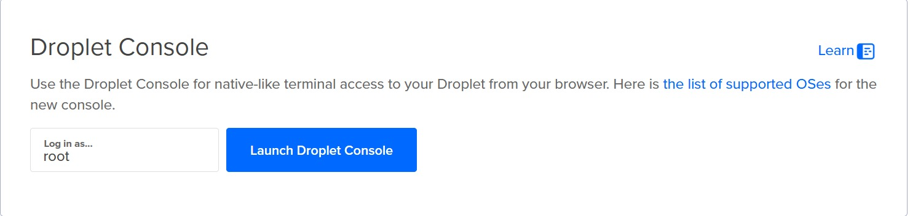
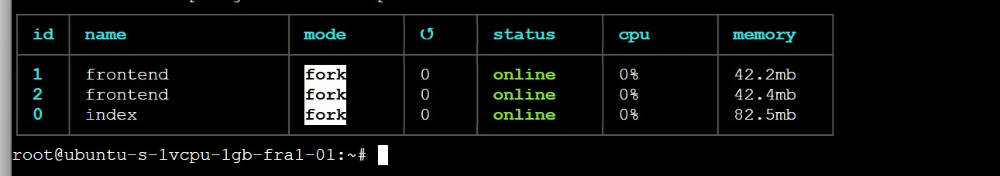

 Deployment Guide

## Uploading the app

To upload the app to Github, we do the following steps:
1. Commit all changes to the local repository:
   bash
   git switch develop
   git checkout -b feature/your-feature-name
   git add .
   git commit -m "Your commit message"
   
2. Push the changes to the remote repository:
   bash
   git push origin feature/your-feature-name
   
3. Deploy the app to the server (DigitalOcean):
   bash
   ssh user@your-server "cd /path/to/your/app && git pull origin feature/your-feature-name && npm install && pm2 restart all"
   
   But we do not follow these steps, we access the server trough the Root Console in DigitalOcean.
   

    Then we do the following commands:
    bash
    cd /path/to/your/app
    git pull origin main
    npm install
    pm2 restart all
    
    ## Screenshot of PM2
    
