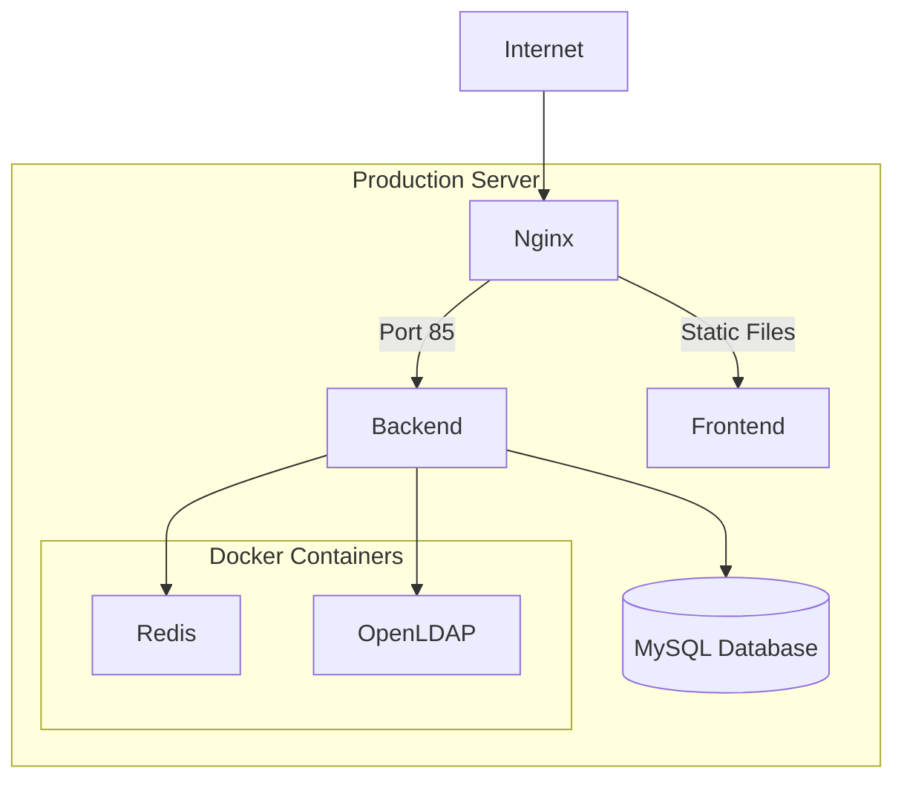

# Deployment Guide

[](https://www.docker.com/)
[](https://nginx.org/)
[](https://ubuntu.com/)
[](https://letsencrypt.org/)

---

## Table of Contents

- [Overview](#overview)
- [Prerequisites](#prerequisites)
- [Server Setup](#server-setup)
- [Docker Deployment](#docker-deployment)
- [Manual Deployment](#manual-deployment)
- [Reverse Proxy Configuration](#reverse-proxy-configuration)
- [SSL/TLS Configuration](#ssltls-configuration)
- [Environment Configuration](#environment-configuration)
- [Database Setup](#database-setup)
- [Process Management](#process-management)
- [Monitoring](#monitoring)
- [Backup Strategy](#backup-strategy)
- [Troubleshooting](#troubleshooting)

---

## Overview

This guide covers deploying RobEurope to a production environment. The recommended setup uses:

- Ubuntu 22.04 LTS server
- Docker for infrastructure services (Redis, OpenLDAP)
- Node.js for the application
- Nginx as reverse proxy
- Let's Encrypt for SSL certificates

### Architecture Diagram



---

## Prerequisites

### Server Requirements

| Resource | Minimum | Recommended |
|----------|---------|-------------|
| CPU | 2 cores | 4 cores |
| RAM | 4 GB | 8 GB |
| Storage | 20 GB SSD | 50 GB SSD |
| OS | Ubuntu 20.04+ | Ubuntu 22.04 LTS |

### Software Requirements

- Node.js 18+
- Docker and Docker Compose
- Nginx
- MySQL 8.x (local or managed)
- Git

---

## Server Setup

### Initial Server Configuration

```bash
# Update system
sudo apt update && sudo apt upgrade -y

# Install required packages
sudo apt install -y curl git build-essential

# Install Node.js 18
curl -fsSL https://deb.nodesource.com/setup_18.x | sudo -E bash -
sudo apt install -y nodejs

# Verify installation
node --version
npm --version

# Install Docker
curl -fsSL https://get.docker.com | sh
sudo usermod -aG docker $USER

# Install Docker Compose
sudo apt install -y docker-compose

# Install Nginx
sudo apt install -y nginx

# Install Certbot for SSL
sudo apt install -y certbot python3-certbot-nginx
```

### Firewall Configuration

```bash
# Allow SSH
sudo ufw allow 22

# Allow HTTP and HTTPS
sudo ufw allow 80
sudo ufw allow 443

# Allow application port (if direct access needed)
sudo ufw allow 85

# Enable firewall
sudo ufw enable
```

---

## Docker Deployment

### Infrastructure Services

Create the Docker Compose file for infrastructure:

```yaml
# docker-compose.yml
version: '3.8'

services:
  openldap:
    image: osixia/openldap:1.5.0
    container_name: openldap
    environment:
      LDAP_ORGANISATION: "RobEurope"
      LDAP_DOMAIN: "robeurope.samuelponce.es"
      LDAP_ADMIN_PASSWORD: "${LDAP_ADMIN_PASSWORD}"
      LDAP_CONFIG_PASSWORD: "${LDAP_CONFIG_PASSWORD}"
      LDAP_TLS: "false"
    ports:
      - "389:389"
      - "636:636"
    volumes:
      - ldap_data:/var/lib/ldap
      - ldap_config:/etc/ldap/slapd.d
    networks:
      - robeurope_network
    restart: unless-stopped

  redis:
    image: redis:alpine
    container_name: robeurope-redis
    ports:
      - "6379:6379"
    volumes:
      - redis_data:/data
    networks:
      - robeurope_network
    restart: unless-stopped
    command: redis-server --appendonly yes

volumes:
  ldap_data:
  ldap_config:
  redis_data:

networks:
  robeurope_network:
    driver: bridge
```

### Start Infrastructure

```bash
# Create .env file for Docker
echo "LDAP_ADMIN_PASSWORD=your_secure_password" > .env
echo "LDAP_CONFIG_PASSWORD=your_config_password" >> .env

# Start services
docker-compose up -d

# Verify services
docker-compose ps
```

---

## Manual Deployment

### Clone Repository

```bash
# Create application directory
sudo mkdir -p /var/www/robeurope
sudo chown $USER:$USER /var/www/robeurope

# Clone repository
cd /var/www
git clone https://github.com/s-pl/RobEurope.git robeurope
cd robeurope
```

### Install Dependencies

```bash
# Backend dependencies
cd backend
npm ci --production

# Frontend build
cd ../frontend
npm ci
npm run build
```

### Configure Environment

```bash
# Create production environment file
cat > /var/www/robeurope/backend/.env << EOF
# Server
PORT=85
NODE_ENV=production

# Database
DB_HOST=localhost
DB_PORT=3306
DB_NAME=robeurope_prod
DB_USER=robeurope
DB_PASS=your_db_password

# Security
JWT_SECRET=$(openssl rand -base64 32)
SESSION_SECRET=$(openssl rand -base64 32)

# LDAP
LDAP_URL=ldap://localhost:389
LDAP_BIND_DN=cn=admin,dc=robeurope,dc=samuelponce,dc=es
LDAP_BIND_PASSWORD=your_ldap_password
LDAP_BASE_DN=dc=robeurope,dc=samuelponce,dc=es
LDAP_USER_DN=ou=users

# Redis
REDIS_URL=redis://localhost:6379

# Email (Resend)
RESEND_API_KEY=re_your_api_key

# Push Notifications
VAPID_PUBLIC_KEY=your_public_key
VAPID_PRIVATE_KEY=your_private_key
EOF

# Secure the file
chmod 600 /var/www/robeurope/backend/.env
```

### Run Migrations

```bash
cd /var/www/robeurope/backend
npm run migrate
```

---

## Reverse Proxy Configuration

### Nginx Configuration

```nginx
# /etc/nginx/sites-available/robeurope
server {
    listen 80;
    server_name robeurope.samuelponce.es www.robeurope.samuelponce.es;

    # Redirect HTTP to HTTPS
    return 301 https://$server_name$request_uri;
}

server {
    listen 443 ssl http2;
    server_name robeurope.samuelponce.es www.robeurope.samuelponce.es;

    # SSL configuration (managed by Certbot)
    ssl_certificate /etc/letsencrypt/live/robeurope.samuelponce.es/fullchain.pem;
    ssl_certificate_key /etc/letsencrypt/live/robeurope.samuelponce.es/privkey.pem;
    include /etc/letsencrypt/options-ssl-nginx.conf;
    ssl_dhparam /etc/letsencrypt/ssl-dhparams.pem;

    # Frontend static files
    root /var/www/robeurope/frontend/dist;
    index index.html;

    # Gzip compression
    gzip on;
    gzip_types text/plain text/css application/json application/javascript text/xml application/xml;
    gzip_min_length 1000;

    # Static file caching
    location ~* \.(js|css|png|jpg|jpeg|gif|ico|svg|woff|woff2)$ {
        expires 1y;
        add_header Cache-Control "public, immutable";
    }

    # API proxy
    location /api {
        proxy_pass http://127.0.0.1:85;
        proxy_http_version 1.1;
        proxy_set_header Upgrade $http_upgrade;
        proxy_set_header Connection 'upgrade';
        proxy_set_header Host $host;
        proxy_set_header X-Real-IP $remote_addr;
        proxy_set_header X-Forwarded-For $proxy_add_x_forwarded_for;
        proxy_set_header X-Forwarded-Proto $scheme;
        proxy_cache_bypass $http_upgrade;
        proxy_read_timeout 300s;
    }

    # WebSocket proxy
    location /socket.io {
        proxy_pass http://127.0.0.1:85;
        proxy_http_version 1.1;
        proxy_set_header Upgrade $http_upgrade;
        proxy_set_header Connection "upgrade";
        proxy_set_header Host $host;
        proxy_set_header X-Real-IP $remote_addr;
        proxy_set_header X-Forwarded-For $proxy_add_x_forwarded_for;
    }

    # Swagger docs
    location /api-docs {
        proxy_pass http://127.0.0.1:85;
        proxy_set_header Host $host;
        proxy_set_header X-Real-IP $remote_addr;
    }

    # Uploads
    location /uploads {
        alias /var/www/robeurope/backend/uploads;
        expires 30d;
        add_header Cache-Control "public";
    }

    # SPA fallback
    location / {
        try_files $uri $uri/ /index.html;
    }

    # Security headers
    add_header X-Frame-Options "SAMEORIGIN" always;
    add_header X-Content-Type-Options "nosniff" always;
    add_header X-XSS-Protection "1; mode=block" always;
    add_header Referrer-Policy "strict-origin-when-cross-origin" always;
}
```

### Enable Site

```bash
# Create symbolic link
sudo ln -s /etc/nginx/sites-available/robeurope /etc/nginx/sites-enabled/

# Test configuration
sudo nginx -t

# Reload Nginx
sudo systemctl reload nginx
```

---

## SSL/TLS Configuration

### Obtain Certificate

```bash
# Obtain SSL certificate
sudo certbot --nginx -d robeurope.samuelponce.es -d www.robeurope.samuelponce.es

# Auto-renewal is set up automatically
# Test renewal
sudo certbot renew --dry-run
```

### Certificate Renewal Cron

```bash
# Certbot sets this up automatically, but verify
sudo systemctl status certbot.timer
```

---

## Environment Configuration

### Production Environment Variables

| Variable | Description | Required |
|----------|-------------|----------|
| PORT | Server port | Yes |
| NODE_ENV | Environment (production) | Yes |
| DB_HOST | Database host | Yes |
| DB_PORT | Database port | Yes |
| DB_NAME | Database name | Yes |
| DB_USER | Database user | Yes |
| DB_PASS | Database password | Yes |
| JWT_SECRET | JWT signing key | Yes |
| SESSION_SECRET | Session encryption key | Yes |
| LDAP_URL | LDAP server URL | Yes |
| LDAP_BIND_DN | LDAP bind DN | Yes |
| LDAP_BIND_PASSWORD | LDAP password | Yes |
| LDAP_BASE_DN | LDAP base DN | Yes |
| LDAP_USER_DN | LDAP users OU | Yes |
| REDIS_URL | Redis connection URL | Yes |
| RESEND_API_KEY | Email service API key | Optional |
| VAPID_PUBLIC_KEY | Push notification key | Optional |
| VAPID_PRIVATE_KEY | Push notification key | Optional |

---

## Database Setup

### MySQL Installation

```bash
# Install MySQL
sudo apt install -y mysql-server

# Secure installation
sudo mysql_secure_installation
```

### Create Database and User

```sql
-- Connect to MySQL
sudo mysql

-- Create database
CREATE DATABASE robeurope_prod CHARACTER SET utf8mb4 COLLATE utf8mb4_unicode_ci;

-- Create user
CREATE USER 'robeurope'@'localhost' IDENTIFIED BY 'your_secure_password';

-- Grant privileges
GRANT ALL PRIVILEGES ON robeurope_prod.* TO 'robeurope'@'localhost';
FLUSH PRIVILEGES;

EXIT;
```

---

## Process Management

### Systemd Service

```ini
# /etc/systemd/system/robeurope.service
[Unit]
Description=RobEurope Backend Server
After=network.target mysql.service docker.service

[Service]
Type=simple
User=www-data
WorkingDirectory=/var/www/robeurope/backend
ExecStart=/usr/bin/node index.js
Restart=on-failure
RestartSec=10
StandardOutput=syslog
StandardError=syslog
SyslogIdentifier=robeurope
Environment=NODE_ENV=production

[Install]
WantedBy=multi-user.target
```

### Enable and Start Service

```bash
# Reload systemd
sudo systemctl daemon-reload

# Enable service
sudo systemctl enable robeurope

# Start service
sudo systemctl start robeurope

# Check status
sudo systemctl status robeurope
```

### Service Management Commands

```bash
# Start
sudo systemctl start robeurope

# Stop
sudo systemctl stop robeurope

# Restart
sudo systemctl restart robeurope

# View logs
sudo journalctl -u robeurope -f
```

---

## Monitoring

### Application Logs

```bash
# View application logs
tail -f /var/www/robeurope/backend/logs/app-*.log

# View access logs
tail -f /var/www/robeurope/backend/logs/access-*.log

# View Nginx logs
tail -f /var/log/nginx/access.log
tail -f /var/log/nginx/error.log
```

### Health Checks

```bash
# Check application health
curl -s http://localhost:85/api/whoami | jq

# Check Redis
redis-cli ping

# Check MySQL
mysql -u robeurope -p -e "SELECT 1"

# Check Docker containers
docker-compose ps
```

### Resource Monitoring

```bash
# System resources
htop

# Disk usage
df -h

# Memory usage
free -h

# Docker stats
docker stats
```

---

## Backup Strategy

### Database Backup

```bash
#!/bin/bash
# /opt/scripts/backup-db.sh

BACKUP_DIR=/var/backups/robeurope
DATE=$(date +%Y%m%d_%H%M%S)
FILENAME="robeurope_${DATE}.sql.gz"

mkdir -p $BACKUP_DIR

mysqldump -u robeurope -p'password' robeurope_prod | gzip > $BACKUP_DIR/$FILENAME

# Keep only last 7 days
find $BACKUP_DIR -name "*.sql.gz" -mtime +7 -delete
```

### Cron Schedule

```bash
# Edit crontab
crontab -e

# Add daily backup at 3 AM
0 3 * * * /opt/scripts/backup-db.sh
```

### Docker Volume Backup

```bash
#!/bin/bash
# Backup Redis and LDAP data

docker run --rm -v robeurope_redis_data:/data -v /var/backups:/backup alpine \
  tar czf /backup/redis_backup_$(date +%Y%m%d).tar.gz /data

docker run --rm -v robeurope_ldap_data:/data -v /var/backups:/backup alpine \
  tar czf /backup/ldap_backup_$(date +%Y%m%d).tar.gz /data
```

---

## Troubleshooting

### Common Issues

#### Application Won't Start

```bash
# Check logs
journalctl -u robeurope -n 100

# Check port availability
sudo lsof -i :85

# Check environment file
cat /var/www/robeurope/backend/.env

# Check Node.js version
node --version
```

#### Database Connection Failed

```bash
# Test MySQL connection
mysql -u robeurope -p -h localhost robeurope_prod

# Check MySQL status
sudo systemctl status mysql

# Check MySQL logs
sudo tail -f /var/log/mysql/error.log
```

#### Redis Connection Failed

```bash
# Check Redis container
docker logs robeurope-redis

# Test Redis connection
redis-cli ping

# Restart Redis
docker-compose restart redis
```

#### LDAP Connection Failed

```bash
# Check LDAP container
docker logs openldap

# Test LDAP connection
ldapsearch -x -H ldap://localhost:389 -b "dc=robeurope,dc=samuelponce,dc=es"

# Restart LDAP
docker-compose restart openldap
```

#### 502 Bad Gateway

```bash
# Check if application is running
sudo systemctl status robeurope

# Check Nginx configuration
sudo nginx -t

# Check Nginx logs
sudo tail -f /var/log/nginx/error.log
```

### Performance Issues

```bash
# Check system resources
htop

# Check slow queries
sudo tail -f /var/log/mysql/slow.log

# Check Node.js memory usage
ps aux | grep node

# Restart application
sudo systemctl restart robeurope
```

---

## Update Procedure

### Application Update

```bash
# Pull latest changes
cd /var/www/robeurope
git pull origin main

# Update backend dependencies
cd backend
npm ci --production

# Run migrations
npm run migrate

# Rebuild frontend
cd ../frontend
npm ci
npm run build

# Restart application
sudo systemctl restart robeurope
```

### Zero-Downtime Update

For zero-downtime deployments, consider using PM2 cluster mode or deploying to a staging environment first.

---

## Related Documentation

- [Architecture Overview](architecture.md)
- [Backend Guide](backend.md)
- [API Reference](api.md)
