# System Diagrams

---

## Table of Contents

- [Entity Relationship Diagram](#entity-relationship-diagram)
- [Class Diagrams](#class-diagrams)
- [Sequence Diagrams](#sequence-diagrams)
- [State Diagrams](#state-diagrams)
- [Component Diagrams](#component-diagrams)
- [Use Case Diagrams](#use-case-diagrams)
- [Deployment Diagram](#deployment-diagram)

---

## Entity Relationship Diagram

### Complete Database ERD

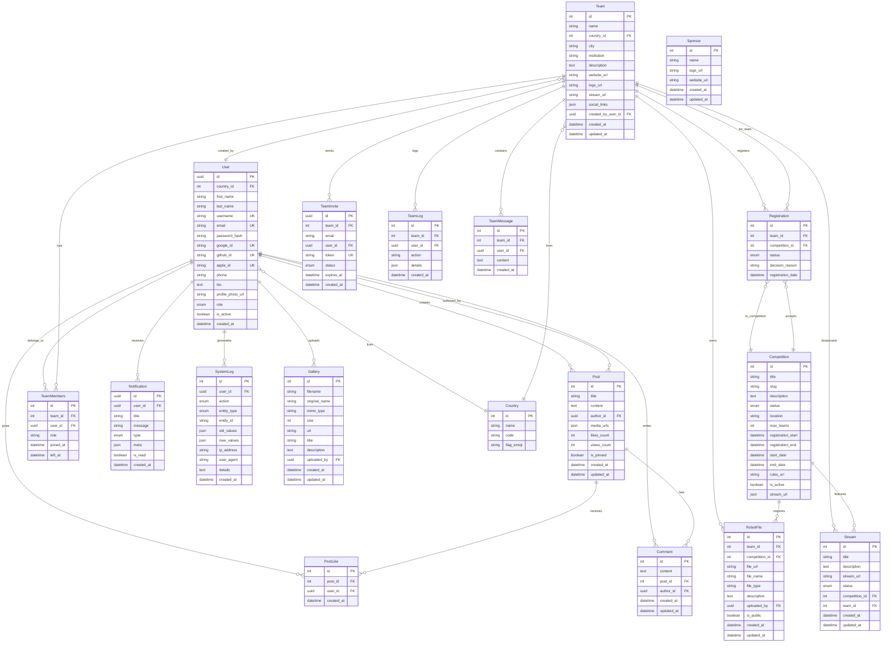
```mermaid
erDiagram
    User ||--o{ Post : creates
    User ||--o{ Comment : writes
    User ||--o{ PostLike : gives
    User ||--o{ TeamMembers : belongs_to
    User ||--o{ Notification : receives
    User ||--o{ SystemLog : generates
    User ||--o{ Gallery : uploads
    User }o--|| Country : from
    
    Team ||--o{ TeamMembers : has
    Team ||--o{ Registration : registers
    Team ||--o{ Stream : broadcasts
    Team ||--o{ RobotFile : owns
    Team ||--o{ TeamInvite : sends
    Team ||--o{ TeamLog : logs
    Team ||--o{ TeamMessage : contains
    Team }o--|| Country : from
    Team }o--|| User : created_by
    
    Competition ||--o{ Registration : accepts
    Competition ||--o{ Stream : features
    Competition ||--o{ RobotFile : requires
    
    Post ||--o{ Comment : has
    Post ||--o{ PostLike : receives
    Post }o--|| User : authored_by
    
    Registration }o--|| Team : for_team
    Registration }o--|| Competition : to_competition

    User {
        uuid id PK
        int country_id FK
        string first_name
        string last_name
        string username UK
        string email UK
        string password_hash
        string google_id UK
        string github_id UK
        string apple_id UK
        string phone
        text bio
        string profile_photo_url
        enum role
        boolean is_active
        datetime created_at
    }

    Team {
        int id PK
        string name
        int country_id FK
        string city
        string institution
        text description
        string website_url
        string logo_url
        string stream_url
        json social_links
        uuid created_by_user_id FK
        datetime created_at
        datetime updated_at
    }

    Competition {
        int id PK
        string title
        string slug
        text description
        enum status
        string location
        int max_teams
        datetime registration_start
        datetime registration_end
        datetime start_date
        datetime end_date
        string rules_url
        boolean is_active
        json stream_url
    }

    Registration {
        int id PK
        int team_id FK
        int competition_id FK
        enum status
        string decision_reason
        datetime registration_date
    }

    Post {
        int id PK
        string title
        text content
        uuid author_id FK
        json media_urls
        int likes_count
        int views_count
        boolean is_pinned
        datetime created_at
        datetime updated_at
    }

    Comment {
        int id PK
        text content
        int post_id FK
        uuid author_id FK
        datetime created_at
        datetime updated_at
    }

    PostLike {
        int id PK
        int post_id FK
        uuid user_id FK
        datetime created_at
    }

    Country {
        int id PK
        string name
        string code
        string flag_emoji
    }

    TeamMembers {
        int id PK
        int team_id FK
        uuid user_id FK
        string role
        datetime joined_at
        datetime left_at
    }

    TeamInvite {
        uuid id PK
        int team_id FK
        string email
        uuid user_id FK
        string token UK
        enum status
        datetime expires_at
        datetime created_at
    }

    TeamLog {
        int id PK
        int team_id FK
        uuid user_id FK
        string action
        json details
        datetime created_at
    }

    TeamMessage {
        int id PK
        int team_id FK
        uuid user_id FK
        text content
        datetime created_at
    }

    Notification {
        uuid id PK
        uuid user_id FK
        string title
        string message
        enum type
        json meta
        boolean is_read
        datetime created_at
    }

    Stream {
        int id PK
        string title
        text description
        string stream_url
        enum status
        int competition_id FK
        int team_id FK
        datetime created_at
        datetime updated_at
    }

    Sponsor {
        int id PK
        string name
        string logo_url
        string website_url
        datetime created_at
        datetime updated_at
    }

    Gallery {
        int id PK
        string filename
        string original_name
        string mime_type
        int size
        string url
        string title
        text description
        uuid uploaded_by FK
        datetime created_at
        datetime updated_at
    }

    RobotFile {
        int id PK
        int team_id FK
        int competition_id FK
        string file_url
        string file_name
        string file_type
        text description
        uuid uploaded_by FK
        boolean is_public
        datetime created_at
        datetime updated_at
    }

    SystemLog {
        int id PK
        uuid user_id FK
        enum action
        enum entity_type
        string entity_id
        json old_values
        json new_values
        string ip_address
        string user_agent
        text details
        datetime created_at
    }
```

### Core Entities ERD

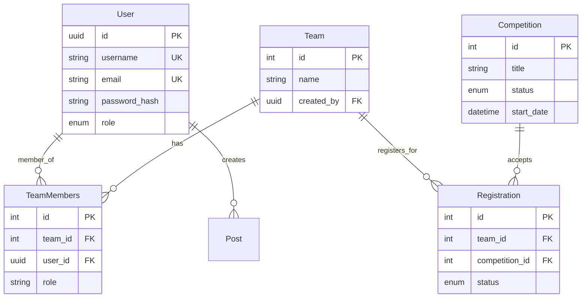
```mermaid
erDiagram
    User ||--o{ TeamMembers : member_of
    User ||--o{ Post : creates
    Team ||--o{ TeamMembers : has
    Team ||--o{ Registration : registers_for
    Competition ||--o{ Registration : accepts

    User {
        uuid id PK
        string username UK
        string email UK
        string password_hash
        enum role
    }

    Team {
        int id PK
        string name
        uuid created_by FK
    }

    Competition {
        int id PK
        string title
        enum status
        datetime start_date
    }

    Registration {
        int id PK
        int team_id FK
        int competition_id FK
        enum status
    }

    TeamMembers {
        int id PK
        int team_id FK
        uuid user_id FK
        string role
    }
```

---

## Class Diagrams

### Backend Controller Classes

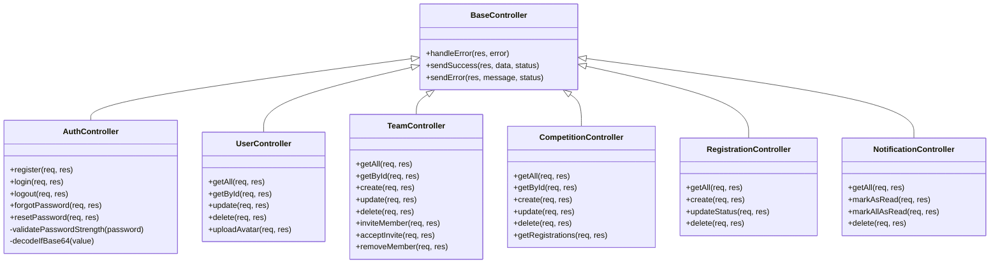
```mermaid
classDiagram
    class BaseController {
        +handleError(res, error)
        +sendSuccess(res, data, status)
        +sendError(res, message, status)
    }

    class AuthController {
        +register(req, res)
        +login(req, res)
        +logout(req, res)
        +forgotPassword(req, res)
        +resetPassword(req, res)
        -validatePasswordStrength(password)
        -decodeIfBase64(value)
    }

    class UserController {
        +getAll(req, res)
        +getById(req, res)
        +update(req, res)
        +delete(req, res)
        +uploadAvatar(req, res)
    }

    class TeamController {
        +getAll(req, res)
        +getById(req, res)
        +create(req, res)
        +update(req, res)
        +delete(req, res)
        +inviteMember(req, res)
        +acceptInvite(req, res)
        +removeMember(req, res)
    }

    class CompetitionController {
        +getAll(req, res)
        +getById(req, res)
        +create(req, res)
        +update(req, res)
        +delete(req, res)
        +getRegistrations(req, res)
    }

    class RegistrationController {
        +getAll(req, res)
        +create(req, res)
        +updateStatus(req, res)
        +delete(req, res)
    }

    class NotificationController {
        +getAll(req, res)
        +markAsRead(req, res)
        +markAllAsRead(req, res)
        +delete(req, res)
    }

    BaseController <|-- AuthController
    BaseController <|-- UserController
    BaseController <|-- TeamController
    BaseController <|-- CompetitionController
    BaseController <|-- RegistrationController
    BaseController <|-- NotificationController
```

### Sequelize Model Classes

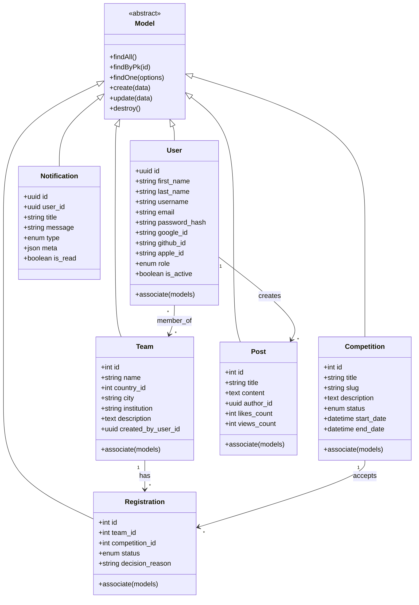
```mermaid
classDiagram
    class Model {
        <<abstract>>
        +findAll()
        +findByPk(id)
        +findOne(options)
        +create(data)
        +update(data)
        +destroy()
    }

    class User {
        +uuid id
        +string first_name
        +string last_name
        +string username
        +string email
        +string password_hash
        +string google_id
        +string github_id
        +string apple_id
        +enum role
        +boolean is_active
        +associate(models)
    }

    class Team {
        +int id
        +string name
        +int country_id
        +string city
        +string institution
        +text description
        +uuid created_by_user_id
        +associate(models)
    }

    class Competition {
        +int id
        +string title
        +string slug
        +text description
        +enum status
        +datetime start_date
        +datetime end_date
        +associate(models)
    }

    class Registration {
        +int id
        +int team_id
        +int competition_id
        +enum status
        +string decision_reason
        +associate(models)
    }

    class Post {
        +int id
        +string title
        +text content
        +uuid author_id
        +int likes_count
        +int views_count
        +associate(models)
    }

    class Notification {
        +uuid id
        +uuid user_id
        +string title
        +string message
        +enum type
        +json meta
        +boolean is_read
    }

    Model <|-- User
    Model <|-- Team
    Model <|-- Competition
    Model <|-- Registration
    Model <|-- Post
    Model <|-- Notification

    User "1" --> "*" Post : creates
    User "*" --> "*" Team : member_of
    Team "1" --> "*" Registration : has
    Competition "1" --> "*" Registration : accepts
```

### Frontend Component Hierarchy

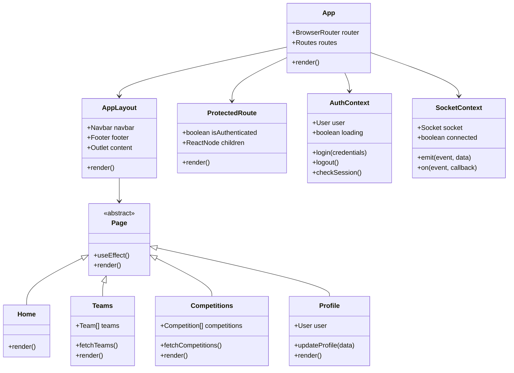
```mermaid
classDiagram
    class App {
        +BrowserRouter router
        +Routes routes
        +render()
    }

    class AppLayout {
        +Navbar navbar
        +Footer footer
        +Outlet content
        +render()
    }

    class ProtectedRoute {
        +boolean isAuthenticated
        +ReactNode children
        +render()
    }

    class AuthContext {
        +User user
        +boolean loading
        +login(credentials)
        +logout()
        +checkSession()
    }

    class SocketContext {
        +Socket socket
        +boolean connected
        +emit(event, data)
        +on(event, callback)
    }

    class Page {
        <<abstract>>
        +useEffect()
        +render()
    }

    class Home {
        +render()
    }

    class Teams {
        +Team[] teams
        +fetchTeams()
        +render()
    }

    class Competitions {
        +Competition[] competitions
        +fetchCompetitions()
        +render()
    }

    class Profile {
        +User user
        +updateProfile(data)
        +render()
    }

    App --> AppLayout
    App --> ProtectedRoute
    App --> AuthContext
    App --> SocketContext
    AppLayout --> Page
    Page <|-- Home
    Page <|-- Teams
    Page <|-- Competitions
    Page <|-- Profile
```

---

## Sequence Diagrams

### User Authentication Flow

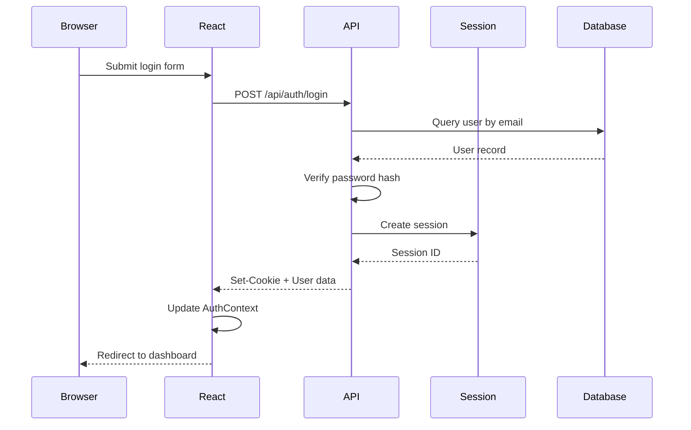
```mermaid
sequenceDiagram
    participant Browser
    participant React
    participant API
    participant Session
    participant Database

    Browser->>React: Submit login form
    React->>API: POST /api/auth/login
    API->>Database: Query user by email
    Database-->>API: User record
    API->>API: Verify password hash
    API->>Session: Create session
    Session-->>API: Session ID
    API-->>React: Set-Cookie + User data
    React->>React: Update AuthContext
    React-->>Browser: Redirect to dashboard
```

### Team Registration for Competition

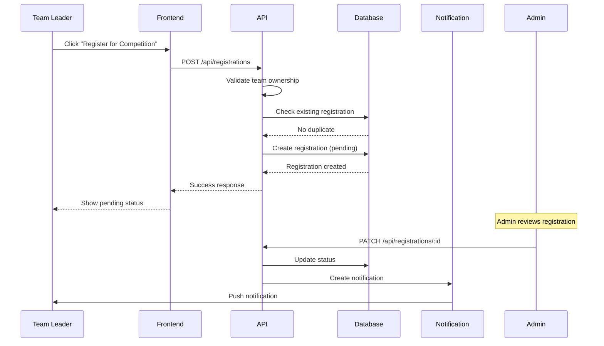
```mermaid
sequenceDiagram
    participant Leader as Team Leader
    participant Frontend
    participant API
    participant Database
    participant Notification
    participant Admin

    Leader->>Frontend: Click "Register for Competition"
    Frontend->>API: POST /api/registrations
    API->>API: Validate team ownership
    API->>Database: Check existing registration
    Database-->>API: No duplicate
    API->>Database: Create registration (pending)
    Database-->>API: Registration created
    API-->>Frontend: Success response
    Frontend-->>Leader: Show pending status

    Note over Admin: Admin reviews registration
    Admin->>API: PATCH /api/registrations/:id
    API->>Database: Update status
    API->>Notification: Create notification
    Notification->>Leader: Push notification
```

### Real-time Team Chat

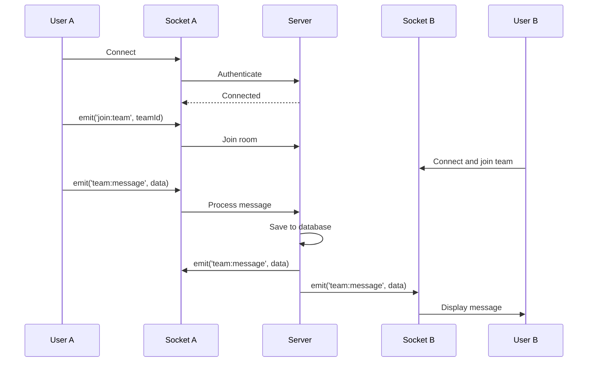
```mermaid
sequenceDiagram
    participant User A
    participant Socket A
    participant Server
    participant Socket B
    participant User B

    User A->>Socket A: Connect
    Socket A->>Server: Authenticate
    Server-->>Socket A: Connected

    User A->>Socket A: emit('join:team', teamId)
    Socket A->>Server: Join room
    
    User B->>Socket B: Connect and join team
    
    User A->>Socket A: emit('team:message', data)
    Socket A->>Server: Process message
    Server->>Server: Save to database
    Server->>Socket A: emit('team:message', data)
    Server->>Socket B: emit('team:message', data)
    Socket B->>User B: Display message
```

### Password Reset Flow

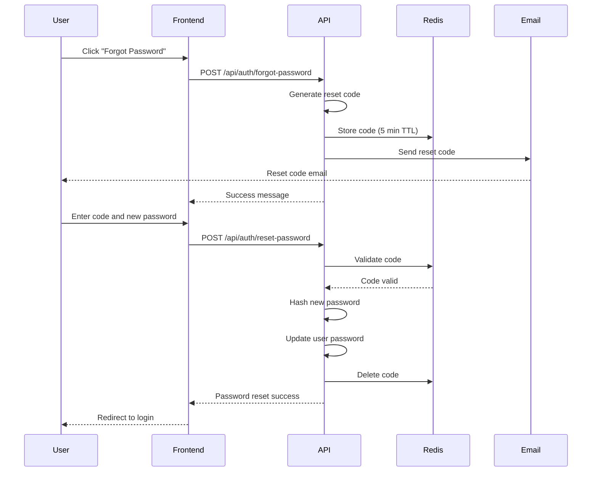
```mermaid
sequenceDiagram
    participant User
    participant Frontend
    participant API
    participant Redis
    participant Email

    User->>Frontend: Click "Forgot Password"
    Frontend->>API: POST /api/auth/forgot-password
    API->>API: Generate reset code
    API->>Redis: Store code (5 min TTL)
    API->>Email: Send reset code
    Email-->>User: Reset code email
    API-->>Frontend: Success message

    User->>Frontend: Enter code and new password
    Frontend->>API: POST /api/auth/reset-password
    API->>Redis: Validate code
    Redis-->>API: Code valid
    API->>API: Hash new password
    API->>API: Update user password
    API->>Redis: Delete code
    API-->>Frontend: Password reset success
    Frontend-->>User: Redirect to login
```

---

## State Diagrams

### Registration Status States

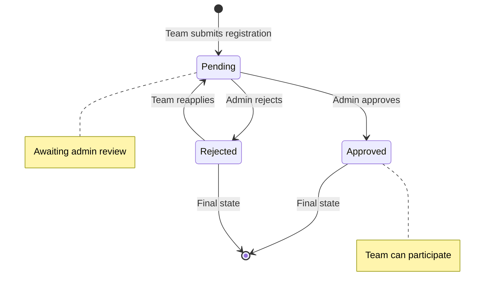
```mermaid
stateDiagram-v2
    [*] --> Pending: Team submits registration
    
    Pending --> Approved: Admin approves
    Pending --> Rejected: Admin rejects
    
    Approved --> [*]: Final state
    Rejected --> Pending: Team reapplies
    Rejected --> [*]: Final state

    note right of Pending
        Awaiting admin review
    end note

    note right of Approved
        Team can participate
    end note
```

### Competition Status States

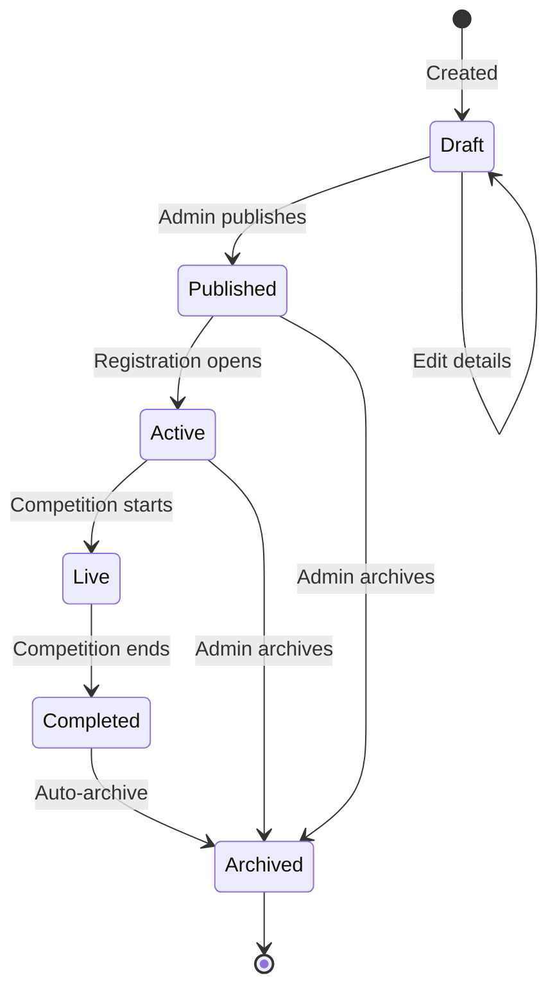
```mermaid
stateDiagram-v2
    [*] --> Draft: Created
    
    Draft --> Published: Admin publishes
    Draft --> Draft: Edit details
    
    Published --> Active: Registration opens
    Active --> Live: Competition starts
    Live --> Completed: Competition ends
    
    Published --> Archived: Admin archives
    Active --> Archived: Admin archives
    Completed --> Archived: Auto-archive
    
    Archived --> [*]
```

### Team Invite Status States

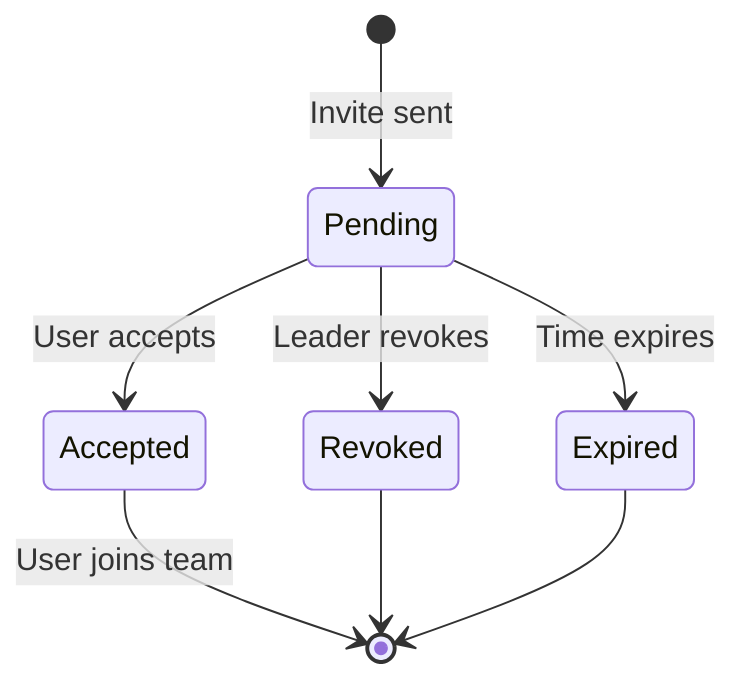
```mermaid
stateDiagram-v2
    [*] --> Pending: Invite sent
    
    Pending --> Accepted: User accepts
    Pending --> Revoked: Leader revokes
    Pending --> Expired: Time expires
    
    Accepted --> [*]: User joins team
    Revoked --> [*]
    Expired --> [*]
```

### Stream Status States

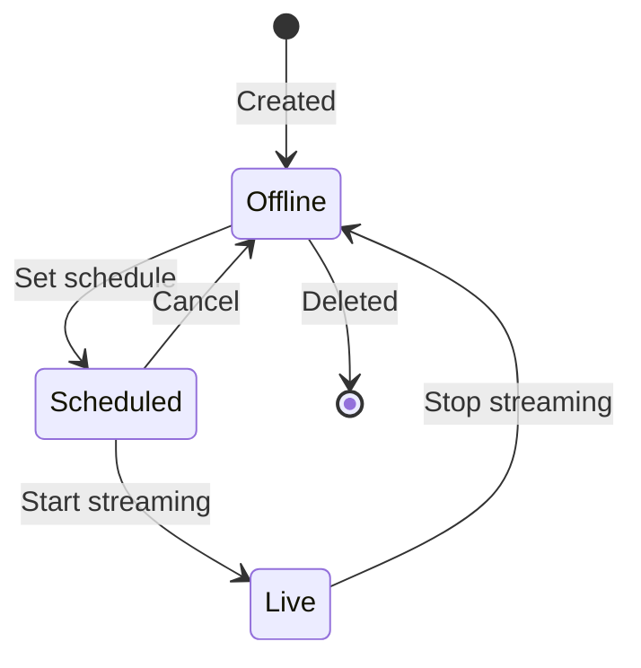
```mermaid
stateDiagram-v2
    [*] --> Offline: Created
    
    Offline --> Scheduled: Set schedule
    Scheduled --> Live: Start streaming
    Scheduled --> Offline: Cancel
    
    Live --> Offline: Stop streaming
    
    Offline --> [*]: Deleted
```

### User Session States

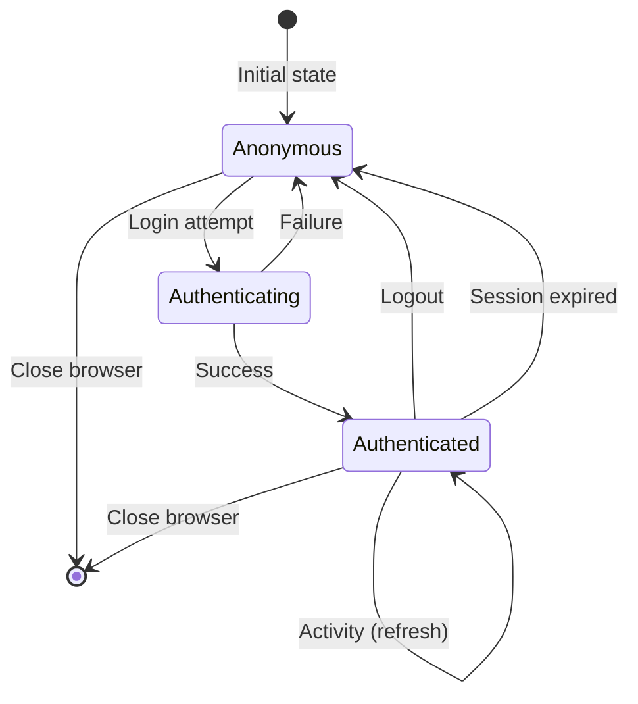
```mermaid
stateDiagram-v2
    [*] --> Anonymous: Initial state

    Anonymous --> Authenticating: Login attempt
    Authenticating --> Authenticated: Success
    Authenticating --> Anonymous: Failure

    Authenticated --> Anonymous: Logout
    Authenticated --> Anonymous: Session expired
    Authenticated --> Authenticated: Activity (refresh)

    Anonymous --> [*]: Close browser
    Authenticated --> [*]: Close browser
```

---

## Component Diagrams

### System Architecture

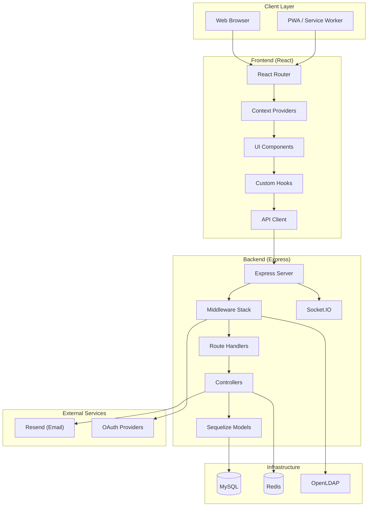
```mermaid
flowchart TB
    subgraph Client["Client Layer"]
        Browser["Web Browser"]
        PWA["PWA / Service Worker"]
    end

    subgraph Frontend["Frontend (React)"]
        Router["React Router"]
        Context["Context Providers"]
        Components["UI Components"]
        Hooks["Custom Hooks"]
        APIClient["API Client"]
    end

    subgraph Backend["Backend (Express)"]
        Express["Express Server"]
        Middleware["Middleware Stack"]
        Routes["Route Handlers"]
        Controllers["Controllers"]
        Models["Sequelize Models"]
        SocketIO["Socket.IO"]
    end

    subgraph Services["External Services"]
        Resend["Resend (Email)"]
        OAuth["OAuth Providers"]
    end

    subgraph Infrastructure["Infrastructure"]
        MySQL[("MySQL")]
        Redis[("Redis")]
        LDAP["OpenLDAP"]
    end

    Browser --> Router
    PWA --> Router
    Router --> Context
    Context --> Components
    Components --> Hooks
    Hooks --> APIClient
    APIClient --> Express
    
    Express --> Middleware
    Middleware --> Routes
    Routes --> Controllers
    Controllers --> Models
    Models --> MySQL
    Controllers --> Redis
    Express --> SocketIO
    Middleware --> LDAP
    
    Controllers --> Resend
    Middleware --> OAuth
```

### Backend Layer Architecture

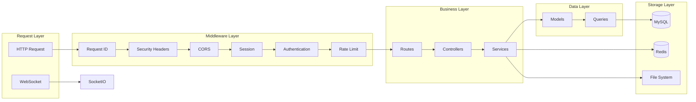
```mermaid
flowchart LR
    subgraph Request["Request Layer"]
        HTTP["HTTP Request"]
        WS["WebSocket"]
    end

    subgraph Middleware["Middleware Layer"]
        RequestID["Request ID"]
        Helmet["Security Headers"]
        CORS["CORS"]
        Session["Session"]
        Auth["Authentication"]
        RateLimit["Rate Limit"]
    end

    subgraph Business["Business Layer"]
        Routes["Routes"]
        Controllers["Controllers"]
        Services["Services"]
    end

    subgraph Data["Data Layer"]
        Models["Models"]
        Queries["Queries"]
    end

    subgraph Storage["Storage Layer"]
        MySQL[("MySQL")]
        Redis[("Redis")]
        FileSystem["File System"]
    end

    HTTP --> RequestID
    WS --> SocketIO
    RequestID --> Helmet
    Helmet --> CORS
    CORS --> Session
    Session --> Auth
    Auth --> RateLimit
    RateLimit --> Routes
    
    Routes --> Controllers
    Controllers --> Services
    Services --> Models
    Models --> Queries
    Queries --> MySQL
    Services --> Redis
    Services --> FileSystem
```

### Frontend Layer Architecture

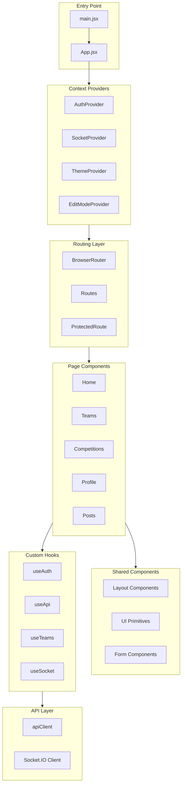
```mermaid
flowchart TB
    subgraph Entry["Entry Point"]
        Main["main.jsx"]
        App["App.jsx"]
    end

    subgraph Providers["Context Providers"]
        AuthProvider["AuthProvider"]
        SocketProvider["SocketProvider"]
        ThemeProvider["ThemeProvider"]
        EditModeProvider["EditModeProvider"]
    end

    subgraph Routing["Routing Layer"]
        BrowserRouter["BrowserRouter"]
        Routes["Routes"]
        ProtectedRoute["ProtectedRoute"]
    end

    subgraph Pages["Page Components"]
        Home["Home"]
        Teams["Teams"]
        Competitions["Competitions"]
        Profile["Profile"]
        Posts["Posts"]
    end

    subgraph Components["Shared Components"]
        Layout["Layout Components"]
        UI["UI Primitives"]
        Forms["Form Components"]
    end

    subgraph Hooks["Custom Hooks"]
        useAuth["useAuth"]
        useApi["useApi"]
        useTeams["useTeams"]
        useSocket["useSocket"]
    end

    subgraph API["API Layer"]
        APIClient["apiClient"]
        SocketClient["Socket.IO Client"]
    end

    Main --> App
    App --> Providers
    Providers --> Routing
    Routing --> Pages
    Pages --> Components
    Pages --> Hooks
    Hooks --> API
```

---

## Use Case Diagrams

### User Use Cases

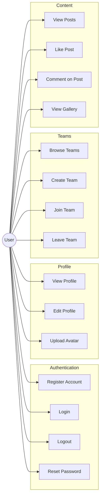
```mermaid
flowchart LR
    User((User))
    
    subgraph Authentication
        Register[Register Account]
        Login[Login]
        Logout[Logout]
        ResetPassword[Reset Password]
    end

    subgraph Profile
        ViewProfile[View Profile]
        EditProfile[Edit Profile]
        UploadAvatar[Upload Avatar]
    end

    subgraph Teams
        ViewTeams[Browse Teams]
        CreateTeam[Create Team]
        JoinTeam[Join Team]
        LeaveTeam[Leave Team]
    end

    subgraph Content
        ViewPosts[View Posts]
        LikePost[Like Post]
        CommentPost[Comment on Post]
        ViewGallery[View Gallery]
    end

    User --> Register
    User --> Login
    User --> Logout
    User --> ResetPassword
    User --> ViewProfile
    User --> EditProfile
    User --> UploadAvatar
    User --> ViewTeams
    User --> CreateTeam
    User --> JoinTeam
    User --> LeaveTeam
    User --> ViewPosts
    User --> LikePost
    User --> CommentPost
    User --> ViewGallery
```

### Team Leader Use Cases

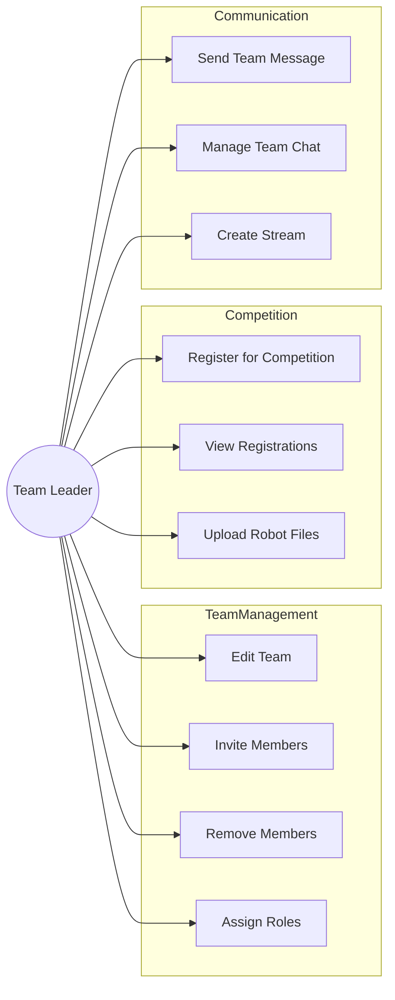
```mermaid
flowchart LR
    Leader((Team Leader))
    
    subgraph TeamManagement
        EditTeam[Edit Team]
        InviteMembers[Invite Members]
        RemoveMembers[Remove Members]
        AssignRoles[Assign Roles]
    end

    subgraph Competition
        RegisterCompetition[Register for Competition]
        ViewRegistrations[View Registrations]
        UploadRobotFiles[Upload Robot Files]
    end

    subgraph Communication
        SendMessage[Send Team Message]
        ManageChat[Manage Team Chat]
        CreateStream[Create Stream]
    end

    Leader --> EditTeam
    Leader --> InviteMembers
    Leader --> RemoveMembers
    Leader --> AssignRoles
    Leader --> RegisterCompetition
    Leader --> ViewRegistrations
    Leader --> UploadRobotFiles
    Leader --> SendMessage
    Leader --> ManageChat
    Leader --> CreateStream
```

### Admin Use Cases

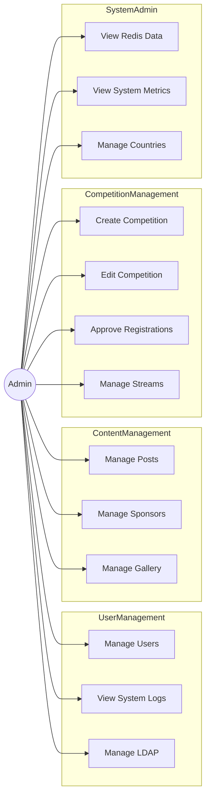
```mermaid
flowchart LR
    Admin((Admin))
    
    subgraph UserManagement
        ManageUsers[Manage Users]
        ViewSystemLogs[View System Logs]
        ManageLDAP[Manage LDAP]
    end

    subgraph ContentManagement
        ManagePosts[Manage Posts]
        ManageSponsors[Manage Sponsors]
        ManageGallery[Manage Gallery]
    end

    subgraph CompetitionManagement
        CreateCompetition[Create Competition]
        EditCompetition[Edit Competition]
        ApproveRegistrations[Approve Registrations]
        ManageStreams[Manage Streams]
    end

    subgraph SystemAdmin
        ViewRedis[View Redis Data]
        ViewMetrics[View System Metrics]
        ManageCountries[Manage Countries]
    end

    Admin --> ManageUsers
    Admin --> ViewSystemLogs
    Admin --> ManageLDAP
    Admin --> ManagePosts
    Admin --> ManageSponsors
    Admin --> ManageGallery
    Admin --> CreateCompetition
    Admin --> EditCompetition
    Admin --> ApproveRegistrations
    Admin --> ManageStreams
    Admin --> ViewRedis
    Admin --> ViewMetrics
    Admin --> ManageCountries
```

---

## Deployment Diagram

### Production Infrastructure

```mermaid
flowchart TB
    subgraph Internet
        Users["Users"]
        DNS["DNS (IONOS)"]
    end

    subgraph CDN["CDN / Proxy"]
        Cloudflare["Cloudflare (Optional)"]
    end

    subgraph Server["VPS / Cloud Server"]
        subgraph WebServer["Web Server"]
            Nginx["Nginx Reverse Proxy"]
        end

        subgraph Application["Application Layer"]
            NodeJS["Node.js Backend"]
            StaticFiles["Frontend Static Files"]
        end

        subgraph Docker["Docker Containers"]
            Redis["Redis Container"]
            LDAP["OpenLDAP Container"]
        end
    end

    subgraph Database["Database Layer"]
        MySQL[("MySQL Server")]
    end

    subgraph Monitoring["Monitoring"]
        Logs["Log Files"]
        SystemD["SystemD Service"]
    end

    Users --> DNS
    DNS --> Cloudflare
    Cloudflare --> Nginx
    Nginx --> NodeJS
    Nginx --> StaticFiles
    NodeJS --> Redis
    NodeJS --> LDAP
    NodeJS --> MySQL
    NodeJS --> Logs
    SystemD --> NodeJS
```

### Docker Container Network

```mermaid
flowchart LR
    subgraph Host["Host Machine"]
        subgraph Network["robeurope_network (bridge)"]
            Redis["redis:alpine<br/>Port: 6379"]
            LDAP["openldap:1.5.0<br/>Ports: 389, 636"]
        end

        subgraph Volumes["Docker Volumes"]
            RedisData["redis_data"]
            LDAPData["ldap_data"]
            LDAPConfig["ldap_config"]
        end

        NodeApp["Node.js App<br/>Port: 85"]
    end

    NodeApp --> Redis
    NodeApp --> LDAP
    Redis --> RedisData
    LDAP --> LDAPData
    LDAP --> LDAPConfig
```

---

## Related Documentation

- [Architecture Overview](architecture.md)
- [Database Schema](database.md)
- [Backend Guide](backend.md)
- [Frontend Guide](frontend.md)
