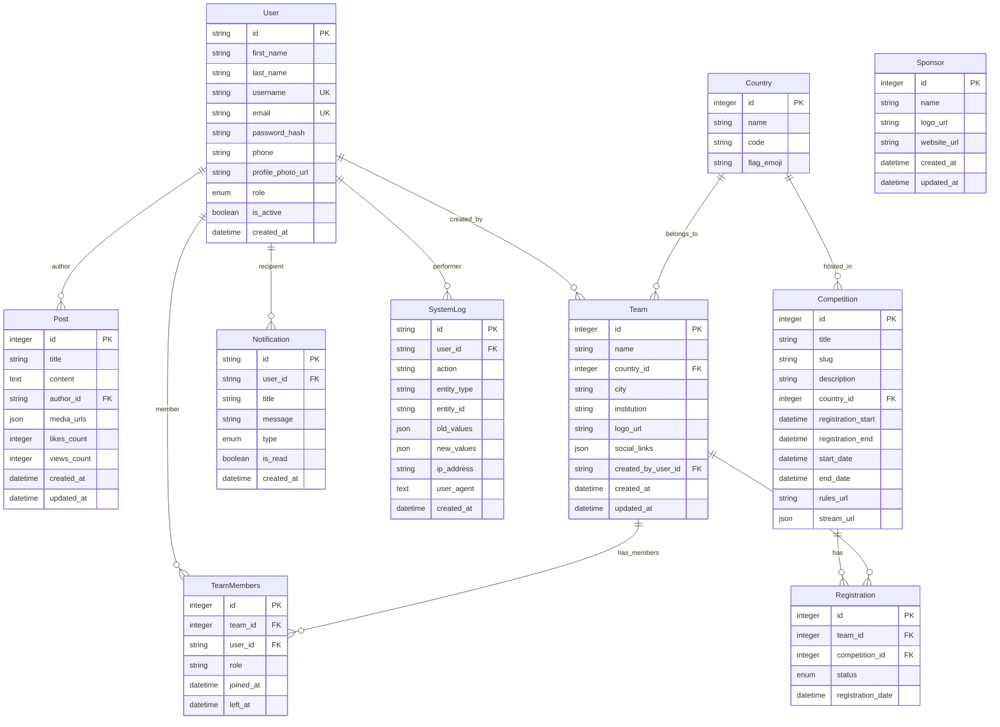

# System Diagrams

## Use Case Diagram

## Class Diagram

## Entity-Relationship Diagram (ERD)

## Architecture Diagram

## Sequence Diagrams

### User Login Sequence

### File Upload Sequence

### Team Creation Sequence

## Component Diagram

## Data Flow Diagram

