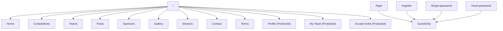
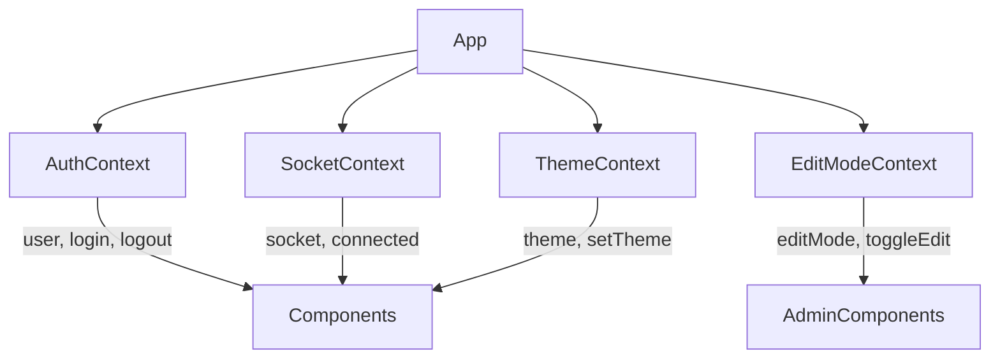
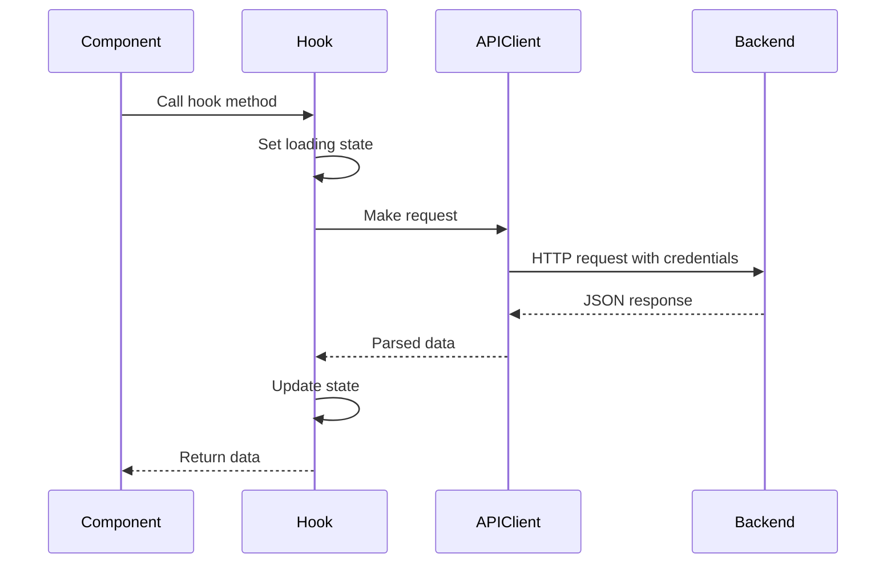

# Frontend Documentation

[](https://reactjs.org/)
[](https://vitejs.dev/)
[](https://tailwindcss.com/)
[](https://reactrouter.com/)
[](https://vitest.dev/)

---

## Table of Contents

- [Overview](#overview)
- [Directory Structure](#directory-structure)
- [Getting Started](#getting-started)
- [Routing](#routing)
- [State Management](#state-management)
- [Components](#components)
- [Hooks](#hooks)
- [API Communication](#api-communication)
- [Styling](#styling)
- [Internationalization](#internationalization)
- [Testing](#testing)
- [Build and Deployment](#build-and-deployment)

---

## Overview

The frontend is a single-page application (SPA) built with React 19 and Vite. It provides the user interface for the RobEurope platform, including authentication flows, team management, competition browsing, and real-time collaboration features.

### Key Features

- Modern React with hooks and functional components
- Fast development with Vite HMR
- TailwindCSS for utility-first styling
- Radix UI for accessible component primitives
- Socket.IO for real-time updates
- Monaco Editor for code editing
- i18next for multi-language support
- PWA capabilities with push notifications

---

## Directory Structure

```
frontend/
├── public/
│   ├── sw.js              # Service worker
│   └── ...                # Static assets
├── src/
│   ├── __tests__/         # Test files
│   ├── assets/            # Images, fonts
│   ├── components/
│   │   ├── admin/         # Admin-specific components
│   │   ├── layout/        # Layout components
│   │   ├── notifications/ # Notification components
│   │   ├── teams/         # Team-related components
│   │   └── ui/            # Reusable UI primitives
│   ├── context/           # React context providers
│   ├── hooks/             # Custom hooks
│   ├── lib/               # Utility functions
│   ├── pages/             # Route-level components
│   ├── test/              # Test utilities
│   ├── App.jsx            # Root component
│   ├── index.css          # Global styles
│   └── main.jsx           # Entry point
├── eslint.config.js       # ESLint configuration
├── index.html             # HTML template
├── package.json           # Dependencies
├── postcss.config.js      # PostCSS configuration
├── tailwind.config.js     # Tailwind configuration
├── vercel.json            # Vercel deployment config
└── vite.config.js         # Vite configuration
```

---

## Getting Started

### Development Server

```bash
# Install dependencies
npm install

# Start development server
npm run dev

# Build for production
npm run build

# Preview production build
npm run preview
```

### Environment Variables

Create a `.env` file in the frontend directory:

```env
VITE_API_BASE_URL=http://localhost:85/api
VITE_SOCKET_URL=http://localhost:85
VITE_IS_BACKEND_ACTIVE=true
```

Set `VITE_IS_BACKEND_ACTIVE=false` to enable mock mode (the UI uses sample data and displays a banner explaining that the backend is off to save resources). The frontend also checks `IS_BACKEND_ACTIVE` if your build pipeline injects non-Vite env vars.

---

## Routing

### Route Structure

Routes are defined in [App.jsx](../frontend/src/App.jsx) using React Router:



### Route Components

| Path | Component | Auth | Description |
|------|-----------|------|-------------|
| `/` | `Home` | Public | Landing page |
| `/competitions` | `Competitions` | Public | Competition listing |
| `/competitions/:id` | `CompetitionDetail` | Public | Competition details |
| `/teams` | `Teams` | Public | Team directory |
| `/my-team` | `MyTeam` | Protected | User's team management |
| `/teams/accept` | `AcceptInvite` | Protected | Team invitation acceptance |
| `/posts` | `Posts` | Public | Blog posts |
| `/gallery` | `Gallery` | Public | Media gallery |
| `/sponsors` | `Sponsors` | Public | Sponsor showcase |
| `/streams` | `Streaming` | Public | Live streams |
| `/profile` | `Profile` | Protected | User profile |
| `/contact` | `Contact` | Public | Contact form |
| `/feedback` | `Feedback` | Public | Feedback submission |
| `/terms` | `Terms` | Public | Terms of service |
| `/login` | `Login` | Guest only | Authentication |
| `/register` | `Register` | Guest only | Registration |
| `/forgot-password` | `ForgotPassword` | Guest only | Password recovery |
| `/reset-password` | `ResetPassword` | Guest only | Password reset |

### Protected Routes

```jsx
// components/ProtectedRoute.jsx
const ProtectedRoute = ({ children }) => {
  const { isAuthenticated, loading } = useAuth();
  
  if (loading) return <LoadingSpinner />;
  if (!isAuthenticated) return <Navigate to="/login" replace />;
  
  return children;
};
```

### Guest Routes

```jsx
// App.jsx
const GuestRoute = ({ children }) => {
  const { isAuthenticated } = useAuth();
  if (isAuthenticated) return <Navigate to="/" replace />;
  return children;
};
```

---

## State Management

### Context Architecture



### Context Providers

#### AuthContext

Manages authentication state and user session:

```jsx
// context/AuthContext.jsx
const AuthContext = createContext(null);

export const AuthProvider = ({ children }) => {
  const [user, setUser] = useState(null);
  const [loading, setLoading] = useState(true);

  useEffect(() => {
    // Check session on mount
    checkSession();
  }, []);

  const login = async (credentials) => {
    const response = await api.post('/auth/login', credentials);
    setUser(response.user);
  };

  const logout = async () => {
    await api.post('/auth/logout');
    setUser(null);
  };

  return (
    <AuthContext.Provider value={{ 
      user, 
      isAuthenticated: !!user, 
      loading,
      login, 
      logout 
    }}>
      {children}
    </AuthContext.Provider>
  );
};
```

#### SocketContext

Provides Socket.IO connection for real-time features:

```jsx
// context/SocketContext.jsx
export const SocketProvider = ({ children }) => {
  const [connected, setConnected] = useState(false);
  const socketUrl = useMemo(() => getApiOrigin(), []);
  const socket = useMemo(() => io(socketUrl, { 
    transports: ['websocket', 'polling'] 
  }), [socketUrl]);

  useEffect(() => {
    socket.on('connect', () => setConnected(true));
    socket.on('disconnect', () => setConnected(false));
    return () => socket.disconnect();
  }, [socket]);

  return (
    <SocketContext.Provider value={{ socket, connected }}>
      {children}
    </SocketContext.Provider>
  );
};
```

#### EditModeContext

Controls admin edit mode for inline editing:

```jsx
// context/EditModeContext.jsx
export const EditModeProvider = ({ children }) => {
  const [editMode, setEditMode] = useState(false);

  const toggleEditMode = () => setEditMode(prev => !prev);

  return (
    <EditModeContext.Provider value={{ editMode, toggleEditMode }}>
      {children}
    </EditModeContext.Provider>
  );
};
```

#### ThemeContext

Manages light/dark theme preference:

```jsx
// context/ThemeContext.jsx
export const ThemeProvider = ({ children }) => {
  const [theme, setTheme] = useState(() => {
    return localStorage.getItem('theme') || 'light';
  });

  useEffect(() => {
    document.documentElement.classList.toggle('dark', theme === 'dark');
    localStorage.setItem('theme', theme);
  }, [theme]);

  return (
    <ThemeContext.Provider value={{ theme, setTheme }}>
      {children}
    </ThemeContext.Provider>
  );
};
```

---

## Components

### Component Organization

```
components/
├── admin/
│   └── AdminEditButton.jsx    # Edit mode toggle
├── layout/
│   ├── AppLayout.jsx          # Main layout wrapper
│   ├── Navbar.jsx             # Navigation bar
│   ├── Footer.jsx             # Site footer
│   └── Sidebar.jsx            # Side navigation
├── notifications/
│   └── NotificationBell.jsx   # Notification indicator
├── teams/
│   ├── TeamCard.jsx           # Team display card
│   ├── TeamMembers.jsx        # Member list
│   └── TeamInviteForm.jsx     # Invitation form
├── ui/
│   ├── button.jsx             # Button component
│   ├── card.jsx               # Card container
│   ├── dialog.jsx             # Modal dialog
│   ├── dropdown-menu.jsx      # Dropdown menus
│   ├── input.jsx              # Form inputs
│   ├── select.jsx             # Select dropdowns
│   ├── toast.jsx              # Toast notifications
│   └── ...                    # Other primitives
└── ProtectedRoute.jsx         # Auth guard
```

### UI Components

UI components are built on top of Radix UI primitives with TailwindCSS styling:

```jsx
// components/ui/button.jsx
import { cva } from 'class-variance-authority';
import { cn } from '@/lib/utils';

const buttonVariants = cva(
  'inline-flex items-center justify-center rounded-md text-sm font-medium transition-colors',
  {
    variants: {
      variant: {
        default: 'bg-primary text-primary-foreground hover:bg-primary/90',
        destructive: 'bg-destructive text-destructive-foreground hover:bg-destructive/90',
        outline: 'border border-input bg-background hover:bg-accent',
        secondary: 'bg-secondary text-secondary-foreground hover:bg-secondary/80',
        ghost: 'hover:bg-accent hover:text-accent-foreground',
        link: 'text-primary underline-offset-4 hover:underline',
      },
      size: {
        default: 'h-10 px-4 py-2',
        sm: 'h-9 rounded-md px-3',
        lg: 'h-11 rounded-md px-8',
        icon: 'h-10 w-10',
      },
    },
    defaultVariants: {
      variant: 'default',
      size: 'default',
    },
  }
);

export const Button = ({ className, variant, size, ...props }) => {
  return (
    <button
      className={cn(buttonVariants({ variant, size, className }))}
      {...props}
    />
  );
};
```

### Layout Components

```jsx
// components/layout/AppLayout.jsx
import { Outlet } from 'react-router-dom';
import Navbar from './Navbar';
import Footer from './Footer';

const AppLayout = () => {
  return (
    <div className="min-h-screen flex flex-col">
      <Navbar />
      <main className="flex-1">
        <Outlet />
      </main>
      <Footer />
    </div>
  );
};
```

---

## Hooks

### Custom Hooks

| Hook | Purpose |
|------|---------|
| `useAuth` | Access authentication context |
| `useApi` | API request helper with loading state |
| `useTeams` | Team data fetching and caching |
| `useCountries` | Country list fetching |
| `useSponsors` | Sponsor data fetching |
| `useStreams` | Stream data and status |
| `useRegistrations` | Registration management |
| `useToast` | Toast notification trigger |

### useApi Hook

```jsx
// hooks/useApi.js
export const useApi = () => {
  const [loading, setLoading] = useState(false);
  const [error, setError] = useState(null);

  const request = async (method, endpoint, data = null) => {
    setLoading(true);
    setError(null);
    try {
      const response = await apiClient[method](endpoint, data);
      return response.data;
    } catch (err) {
      setError(err.response?.data?.error || err.message);
      throw err;
    } finally {
      setLoading(false);
    }
  };

  return { request, loading, error };
};
```

### useTeams Hook

```jsx
// hooks/useTeams.js
export const useTeams = () => {
  const [teams, setTeams] = useState([]);
  const [loading, setLoading] = useState(true);

  useEffect(() => {
    const fetchTeams = async () => {
      try {
        const data = await api.get('/teams');
        setTeams(data);
      } finally {
        setLoading(false);
      }
    };
    fetchTeams();
  }, []);

  const createTeam = async (teamData) => {
    const newTeam = await api.post('/teams', teamData);
    setTeams(prev => [...prev, newTeam]);
    return newTeam;
  };

  return { teams, loading, createTeam };
};
```

### useToast Hook

```jsx
// hooks/useToast.js
import { useContext } from 'react';
import { ToastContext } from '@/components/ui/toast';

export const useToast = () => {
  const context = useContext(ToastContext);
  
  return {
    toast: ({ title, description, variant = 'default' }) => {
      context.addToast({ title, description, variant });
    }
  };
};
```

---

## API Communication

### API Client

```jsx
// lib/apiClient.js
const API_BASE_URL = import.meta.env.VITE_API_BASE_URL || '/api';

export const getApiOrigin = () => {
  const url = new URL(API_BASE_URL);
  return url.origin;
};

const apiClient = {
  async get(endpoint) {
    const response = await fetch(`${API_BASE_URL}${endpoint}`, {
      credentials: 'include',
      headers: { 'Content-Type': 'application/json' }
    });
    if (!response.ok) throw await response.json();
    return response.json();
  },

  async post(endpoint, data) {
    const response = await fetch(`${API_BASE_URL}${endpoint}`, {
      method: 'POST',
      credentials: 'include',
      headers: { 'Content-Type': 'application/json' },
      body: JSON.stringify(data)
    });
    if (!response.ok) throw await response.json();
    return response.json();
  },

  async put(endpoint, data) { /* ... */ },
  async patch(endpoint, data) { /* ... */ },
  async delete(endpoint) { /* ... */ },
};

export default apiClient;
```

### Request Flow



---

## Styling

### TailwindCSS Configuration

```javascript
// tailwind.config.js
export default {
  content: ['./index.html', './src/**/*.{js,jsx}'],
  darkMode: 'class',
  theme: {
    extend: {
      colors: {
        primary: { /* color scale */ },
        secondary: { /* color scale */ },
        accent: { /* color scale */ },
      },
      fontFamily: {
        sans: ['Inter', 'system-ui', 'sans-serif'],
      },
    },
  },
  plugins: [
    require('@tailwindcss/typography'),
    require('tailwindcss-animate'),
  ],
};
```

### Utility Functions

```jsx
// lib/utils.js
import { clsx } from 'clsx';
import { twMerge } from 'tailwind-merge';

export function cn(...inputs) {
  return twMerge(clsx(inputs));
}
```

### Global Styles

```css
/* index.css */
@tailwind base;
@tailwind components;
@tailwind utilities;

@layer base {
  :root {
    --background: 0 0% 100%;
    --foreground: 222.2 84% 4.9%;
    --primary: 222.2 47.4% 11.2%;
    /* ... */
  }

  .dark {
    --background: 222.2 84% 4.9%;
    --foreground: 210 40% 98%;
    /* ... */
  }
}
```

---

## Internationalization

### i18next Setup

```jsx
// main.jsx or i18n.js
import i18n from 'i18next';
import { initReactI18next } from 'react-i18next';

i18n.use(initReactI18next).init({
  resources: {
    en: { translation: { /* English strings */ } },
    es: { translation: { /* Spanish strings */ } },
    de: { translation: { /* German strings */ } },
  },
  lng: 'en',
  fallbackLng: 'en',
  interpolation: { escapeValue: false },
});
```

### Usage in Components

```jsx
import { useTranslation } from 'react-i18next';

const Component = () => {
  const { t, i18n } = useTranslation();

  return (
    <div>
      <h1>{t('welcome.title')}</h1>
      <button onClick={() => i18n.changeLanguage('es')}>
        {t('language.spanish')}
      </button>
    </div>
  );
};
```

---

## Testing

### Test Setup

```javascript
// vitest.config.js
export default {
  test: {
    environment: 'jsdom',
    setupFiles: ['./src/test/setup.js'],
    globals: true,
  },
};
```

### Test Utilities

```jsx
// src/test/setup.js
import '@testing-library/jest-dom';
import { vi } from 'vitest';

// Mock fetch
global.fetch = vi.fn();

// Mock matchMedia
window.matchMedia = vi.fn().mockImplementation(query => ({
  matches: false,
  media: query,
  addEventListener: vi.fn(),
  removeEventListener: vi.fn(),
}));
```

### Component Testing

```jsx
// __tests__/Login.test.jsx
import { render, screen, fireEvent, waitFor } from '@testing-library/react';
import { BrowserRouter } from 'react-router-dom';
import Login from '../pages/Login';

describe('Login Page', () => {
  it('renders login form', () => {
    render(
      <BrowserRouter>
        <Login />
      </BrowserRouter>
    );

    expect(screen.getByLabelText(/email/i)).toBeInTheDocument();
    expect(screen.getByLabelText(/password/i)).toBeInTheDocument();
    expect(screen.getByRole('button', { name: /login/i })).toBeInTheDocument();
  });

  it('submits form with credentials', async () => {
    render(
      <BrowserRouter>
        <Login />
      </BrowserRouter>
    );

    fireEvent.change(screen.getByLabelText(/email/i), {
      target: { value: 'test@example.com' },
    });
    fireEvent.change(screen.getByLabelText(/password/i), {
      target: { value: 'password123' },
    });
    fireEvent.click(screen.getByRole('button', { name: /login/i }));

    await waitFor(() => {
      expect(global.fetch).toHaveBeenCalled();
    });
  });
});
```

### Running Tests

```bash
# Run all tests
npm test

# Run with coverage
npm run coverage

# Run specific file
npx vitest run Login.test.jsx
```

---

## Build and Deployment

### Production Build

```bash
npm run build
```

This creates an optimized production build in the `dist/` directory.

### Vercel Deployment

The project includes `vercel.json` for Vercel deployment:

```json
{
  "rewrites": [
    { "source": "/(.*)", "destination": "/index.html" }
  ]
}
```

### Build Output

```
dist/
├── assets/
│   ├── index-[hash].js
│   ├── index-[hash].css
│   └── vendor-[hash].js
├── index.html
└── ...
```

### Performance Optimization

- Code splitting via dynamic imports
- Tree shaking for unused code removal
- Asset minification and compression
- Image optimization
- Lazy loading for route components

```jsx
// Lazy loading example
const CompetitionDetail = lazy(() => import('./pages/CompetitionDetail'));

<Route 
  path="competitions/:id" 
  element={
    <Suspense fallback={<LoadingSpinner />}>
      <CompetitionDetail />
    </Suspense>
  } 
/>
```

---

## Related Documentation

- [Architecture Overview](architecture.md)
- [Backend Guide](backend.md)
- [API Reference](api.md)
- [Deployment Guide](deployment.md)
