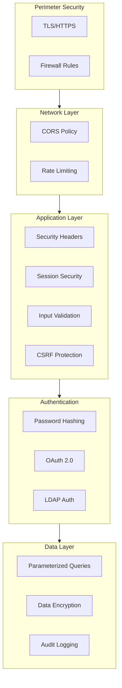

# Security Documentation

[](https://owasp.org/)
[](https://letsencrypt.org/)
[](https://owasp.org/www-project-top-ten/)

---

## Table of Contents

- [Overview](#overview)
- [Authentication](#authentication)
- [Authorization](#authorization)
- [Session Management](#session-management)
- [Input Validation](#input-validation)
- [Security Headers](#security-headers)
- [Rate Limiting](#rate-limiting)
- [Data Protection](#data-protection)
- [LDAP Security](#ldap-security)
- [Security Checklist](#security-checklist)

---

## Overview

RobEurope implements multiple layers of security to protect user data and prevent common vulnerabilities. This document outlines the security measures in place and best practices for maintaining a secure deployment.

### Security Architecture



---

## Authentication

### Password Authentication

Passwords are hashed using bcrypt with a cost factor of 10:

```javascript
import bcrypt from 'bcryptjs';

// Hash password
const password_hash = await bcrypt.hash(password, 10);

// Verify password
const isValid = await bcrypt.compare(password, user.password_hash);
```

### Password Requirements

- Minimum 8 characters
- Must contain at least 3 of:
  - Uppercase letters
  - Lowercase letters
  - Numbers
  - Special characters

```javascript
function validatePasswordStrength(password) {
  if (password.length < 8) {
    return 'Password must be at least 8 characters';
  }
  
  const hasLower = /[a-z]/.test(password);
  const hasUpper = /[A-Z]/.test(password);
  const hasDigit = /\d/.test(password);
  const hasSymbol = /[^A-Za-z0-9]/.test(password);
  
  const groups = [hasLower, hasUpper, hasDigit, hasSymbol].filter(Boolean).length;
  
  if (groups < 3) {
    return 'Password must include 3 types: uppercase, lowercase, numbers, or symbols';
  }
  
  return null;
}
```

### OAuth 2.0 Integration

Supported OAuth providers:

| Provider | Implementation |
|----------|----------------|
| Google | passport-google-oauth20 |
| GitHub | passport-github2 |
| Apple | passport-apple (Not yet) | -

### Login Throttling

Failed login attempts are tracked in Redis with exponential backoff:

```javascript
// Track failed attempts
const key = `login:attempts:${email}`;
const attempts = await redis.incr(key);
await redis.expire(key, 900); // 15 minutes

if (attempts > 5) {
  return res.status(429).json({ 
    error: 'Too many failed attempts. Try again later.' 
  });
}
```

---

## Authorization

### Role-Based Access Control

| Role | Permissions |
|------|-------------|
| `user` | Basic user actions, own resources |
| `super_admin` | Full system access |

### Role Middleware

```javascript
export function requireRole(...roles) {
  return (req, res, next) => {
    if (!req.user) {
      return res.status(401).json({ error: 'Unauthorized' });
    }
    
    if (!roles.includes(req.user.role)) {
      return res.status(403).json({ error: 'Forbidden' });
    }
    
    next();
  };
}

// Usage
router.delete('/users/:id', 
  authenticateToken, 
  requireRole('super_admin'), 
  deleteUser
);
```

### Resource Ownership

```javascript
export function checkOwnership(model, paramKey = 'id', ownerField = 'user_id') {
  return async (req, res, next) => {
    const resource = await model.findByPk(req.params[paramKey]);
    
    if (!resource) {
      return res.status(404).json({ error: 'Not found' });
    }
    
    const isOwner = resource[ownerField] === req.user.id;
    const isAdmin = req.user.role === 'super_admin';
    
    if (!isOwner && !isAdmin) {
      return res.status(403).json({ error: 'Forbidden' });
    }
    
    req.resource = resource;
    next();
  };
}
```

---

## Session Management

### Session Configuration

```javascript
app.use(session({
  secret: process.env.SESSION_SECRET,
  store: new SequelizeStore({ db: sequelize }),
  resave: false,
  saveUninitialized: false,
  proxy: true,
  cookie: {
    secure: process.env.NODE_ENV === 'production',
    httpOnly: true,
    sameSite: 'lax',
    maxAge: 1000 * 60 * 60 * 24 // 24 hours
  }
}));
```

### Cookie Security Attributes

| Attribute | Value | Purpose |
|-----------|-------|---------|
| `secure` | true (prod) | HTTPS only |
| `httpOnly` | true | Prevent XSS access |
| `sameSite` | lax | CSRF protection |
| `maxAge` | 24 hours | Session expiration |

### Session Storage

Sessions are stored in MySQL via Sequelize:

```javascript
const SequelizeStore = require('connect-session-sequelize')(session.Store);

const sessionStore = new SequelizeStore({
  db: sequelize,
  tableName: 'Session',
  checkExpirationInterval: 15 * 60 * 1000, // 15 minutes
  expiration: 24 * 60 * 60 * 1000 // 24 hours
});
```

---

## Input Validation

### Server-Side Validation

All user input is validated on the server:

```javascript
export const createTeam = async (req, res) => {
  const { name, description, country_id } = req.body;
  
  // Required field validation
  if (!name || typeof name !== 'string') {
    return res.status(400).json({ error: 'Name is required' });
  }
  
  // Length validation
  if (name.length < 2 || name.length > 100) {
    return res.status(400).json({ error: 'Name must be 2-100 characters' });
  }
  
  // Sanitization (if needed)
  const sanitizedName = name.trim();
  
  // Continue with creation...
};
```

### SQL Injection Prevention

Sequelize ORM uses parameterized queries:

```javascript
// Safe - parameterized query
const user = await User.findOne({
  where: { email: userInput }
});

// Never do this
// const user = await sequelize.query(`SELECT * FROM Users WHERE email = '${userInput}'`);
```

### XSS Prevention

- Frontend uses React which escapes output by default
- Backend sanitizes HTML content where needed
- Content-Type headers are set correctly

---

## Security Headers

### Helmet Configuration

```javascript
app.use(helmet({
  crossOriginResourcePolicy: false,
  contentSecurityPolicy: false // Configured separately if needed
}));
```

### Headers Applied

| Header | Value | Purpose |
|--------|-------|---------|
| X-DNS-Prefetch-Control | off | Privacy |
| X-Frame-Options | SAMEORIGIN | Clickjacking |
| X-Content-Type-Options | nosniff | MIME sniffing |
| X-XSS-Protection | 0 | Legacy XSS filter |
| Strict-Transport-Security | max-age=15552000 | HTTPS enforcement |
| X-Download-Options | noopen | IE file downloads |
| X-Permitted-Cross-Domain-Policies | none | Flash/PDF policies |
| Referrer-Policy | no-referrer | Privacy |

---

## Rate Limiting

### Global Rate Limit

```javascript
import rateLimit from 'express-rate-limit';

const limiter = rateLimit({
  windowMs: 15 * 60 * 1000, // 15 minutes
  max: 100, // requests per window
  standardHeaders: true,
  legacyHeaders: false,
  message: { error: 'Too many requests, please try again later' }
});

app.use('/api', limiter);
```

### Endpoint-Specific Limits

| Endpoint | Limit | Window |
|----------|-------|--------|
| General API | 100 | 15 min |
| Auth endpoints | 10 | 15 min |
| File uploads | 20 | 1 hour |

### Login Rate Limiting

```javascript
const loginLimiter = rateLimit({
  windowMs: 15 * 60 * 1000,
  max: 10,
  skipSuccessfulRequests: true,
  message: { error: 'Too many login attempts' }
});

router.post('/login', loginLimiter, login);
```

---

## Data Protection

### Sensitive Data Handling

```javascript
// Never return password hash
const userResponse = {
  id: user.id,
  email: user.email,
  first_name: user.first_name,
  // password_hash is excluded
};

// Mask sensitive data in logs
logger.info('User logged in', { userId: user.id });
// Never log passwords or tokens
```

### File Upload Security

```javascript
const upload = multer({
  storage: multer.diskStorage({
    destination: 'uploads/',
    filename: (req, file, cb) => {
      // Generate unique filename
      const unique = `${Date.now()}-${crypto.randomBytes(8).toString('hex')}`;
      cb(null, `${unique}${path.extname(file.originalname)}`);
    }
  }),
  limits: {
    fileSize: 10 * 1024 * 1024 // 10MB max
  },
  fileFilter: (req, file, cb) => {
    const allowedMimes = ['image/jpeg', 'image/png', 'image/gif'];
    if (allowedMimes.includes(file.mimetype)) {
      cb(null, true);
    } else {
      cb(new Error('Invalid file type'));
    }
  }
});
```

### Environment Variables

```bash
# Secure storage of secrets
JWT_SECRET=<generated-secret>
SESSION_SECRET=<generated-secret>
DB_PASS=<secure-password>

# Never commit .env files
# .env is in .gitignore
```

---

## LDAP Security

### Secure Binding

```javascript
const ldapOptions = {
  url: process.env.LDAP_URL,
  bindDN: process.env.LDAP_BIND_DN,
  bindCredentials: process.env.LDAP_BIND_PASSWORD,
  searchBase: process.env.LDAP_BASE_DN,
  searchFilter: '(uid={{username}})'
};
```

### LDAP Injection Prevention

```javascript
// Escape special characters in LDAP queries
function escapeLDAP(str) {
  return str.replace(/[\\*()\\x00]/g, (char) => {
    return '\\' + char.charCodeAt(0).toString(16);
  });
}

const safeUsername = escapeLDAP(username);
```

---

## Security Checklist

### Development

- [ ] Use HTTPS in production
- [ ] Keep dependencies updated
- [ ] Validate all user input
- [ ] Use parameterized queries
- [ ] Hash passwords properly
- [ ] Implement rate limiting
- [ ] Set secure cookie flags
- [ ] Use security headers
- [ ] Log security events
- [ ] Review code for vulnerabilities

### Deployment

- [ ] Configure firewall rules
- [ ] Enable TLS 1.2+
- [ ] Set strong session secrets
- [ ] Disable debug mode
- [ ] Configure CORS properly
- [ ] Set up log rotation
- [ ] Enable automatic updates
- [ ] Backup encryption keys
- [ ] Monitor for intrusions
- [ ] Plan incident response

### Ongoing

- [ ] Regular security audits
- [ ] Dependency vulnerability scanning
- [ ] Penetration testing
- [ ] Security training
- [ ] Incident response drills
- [ ] Review access logs
- [ ] Update security policies
- [ ] Monitor CVE databases

---

## Incident Response

### Security Incident Procedure

1. **Identify** - Detect and confirm the incident
2. **Contain** - Limit the damage
3. **Eradicate** - Remove the threat
4. **Recover** - Restore normal operations
5. **Learn** - Document and improve

### Contact

For security vulnerabilities, contact the maintainers directly rather than opening a public issue.

---

## Related Documentation

- [Backend Guide](backend.md)
- [Deployment Guide](deployment.md)
- [API Reference](api.md)
